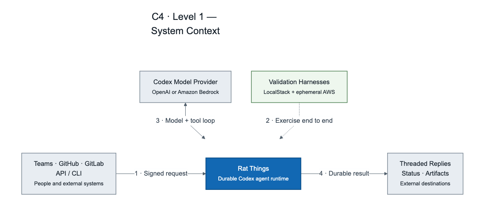
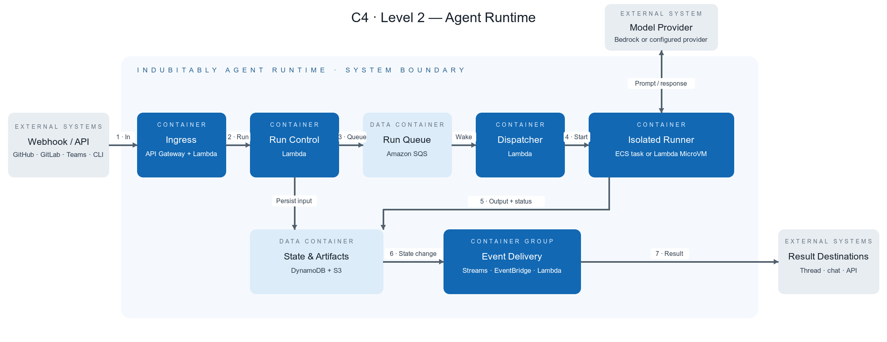
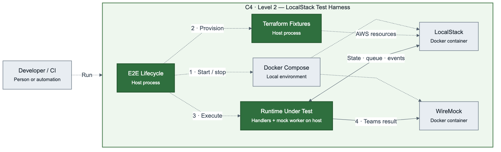
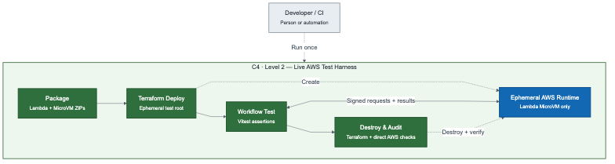

# Rat Things

<p align="center">
  
</p>

<p align="center">
  <strong>The open-source backend for cloud agents.</strong>
</p>

<p align="center">
  <a href="https://github.com/gpazo/Rat-Things/actions/workflows/ci.yml"></a>
  <a href="LICENSE"></a>
  
  
  
</p>

<p align="center">
  <a href="https://gpazo.github.io/Rat-Things/">Website</a> ·
  <a href="https://gpazo.github.io/Rat-Things/docs/">Documentation</a> ·
  <a href="docs/operating-model.md">How it works</a> ·
  <a href="docs/agents.md">Connect an agent</a> ·
  <a href="docs/things.md">Build a Thing</a> ·
  <a href="docs/plugins.md">Connect accounts</a> ·
  <a href="docs/embedding.md">Embed the API</a> ·
  <a href="https://gpazo.github.io/Rat-Things/llms.txt">Agent docs</a> ·
  <a href="docs/status-and-roadmap.md">Validation status</a>
</p>

Rat Things is the open-source, self-hostable backend for cloud agents, applications, CLIs, and
provider events. Install one independent deployment in your AWS account, bring your identity and
OAuth applications, connect provider-verified accounts, and publish reusable **Things** through one
documented API.

Every consumer follows the same narrow path: discover the deployment, connect an account, define a
Thing, explain and test its draft, publish the exact immutable revision, then run and observe durable
evidence. The CLI is a client of that contract—not a privileged interface—so a personal
installation, small-business console, embedded SaaS product, another agent, or signed webhook can
use the same primitives.

Rat Things does not require a central Rat-operated control plane, visual workflow editor,
marketplace, or hosted OAuth service. The host chooses whether one deployment serves one person or
many authenticated users and owns the surrounding product experience.

Underneath that simple contract, tool-capable Codex work runs in AWS Lambda MicroVMs. Compute is
disposable but the work is durable: account grants, Thing revisions, conversations, Codex state,
workspace bytes, events, files, and results live outside the VM and remain owner-scoped.

> Once this narrow journey is delightful and stable, expand it. Start with the
> [operating model](docs/operating-model.md).

> [!WARNING]
> Rat Things is an engineering preview. Its deterministic workflow and minimal real-Codex paths
> have been validated locally and in disposable AWS infrastructure, but it has not completed a
> production security review, sustained-load exercise, or multi-tenant hardening. Lambda MicroVMs
> are a new AWS service available only in selected Regions.

> [!TIP]
> **Bring the Codex subscription you already have.** On a trusted local device, Rat Things uses
> the official ChatGPT browser sign-in—no Platform API key or Bedrock account is required. After
> `npm ci`, run `npm run codex:login`, then
> `npm run rat-things -- local "Summarize this repository"`.
> See the [two-command subscription setup](docs/codex-subscription.md).
>
> **Connect GitHub in one command.** `npm run webhook:github -- --repo OWNER/REPOSITORY` creates
> the AWS secrets, deploys the signed route, registers the repository webhook, and tells you the
> exact PR comment trigger. It prompts before changing either account.

## Why Rat Things?

- **One backend, many consumers** — use the same owner-scoped API from a CLI, operator console,
  embedded product, another agent, schedule, or signed provider event.
- **Reusable Things** — append immutable definitions with explicit draft and active pointers; test
  safely, then publish the exact goal, trigger, capabilities, accounts, and delivery that production
  will use without embedding credentials or customer identity logic.
- **Verified multi-account integrations** — connect several accounts for one service; provider
  authority, Rat grants, Thing narrowing, resource constraints, and approvals intersect at runtime.
- **Self-describing UX primitives** — discovery, OpenAPI, JSON Schemas, integration manifests,
  stable errors, and Thing explanations let consumers generate simple, accurate experiences.
- **Bring your own product boundary** — each deployment owns its identity, OAuth applications,
  secrets, data, and runtime; Rat Things does not require a hosted tenant service.
- **Dedicated VM isolation** — every active agent session runs in its own Firecracker-backed guest
  with shell, Git, filesystem, explicitly permitted networking, and browser computer use.
- **Serverless, durable execution** — MicroVMs suspend, resume, terminate, and replace while AWS
  storage retains orchestration, conversations, Codex state, workspace bytes, events, and results.
- **Live control and evidence** — consumers can stream events, answer approvals and input requests,
  steer or interrupt work, and retain files, publications, screenshots, and video.
- **One run model** — manual and EventBridge-scheduled Things, signed provider-event runs, raw runs,
  and conversations converge on the same asynchronous execution and delivery contract.
- **Revision evidence** — every Thing test/run receipt identifies the exact immutable revision and
  spec hash that produced its durable run.
- **Codex-first access** — trusted local work can use an existing ChatGPT subscription; AWS runs use
  short-term Bedrock authentication.
- **Disposable proof** — deterministic simulation, LocalStack, and live-AWS harnesses exercise the
  intended journeys and tear down their temporary infrastructure.

The useful framing from this [r/aws discussion of Lambda MicroVM
workloads](https://www.reddit.com/r/aws/comments/1ueul5o/hardest_problems_lambda_microvms_can_solve_now/)
is the changed tradeoff: VM-level isolation and stateful sessions with a serverless lifecycle. AWS
describes the same design point as dedicated guest isolation, rapid snapshot launch/resume, and
stateful execution for user- or AI-generated code in its [Lambda MicroVM launch
post](https://aws.amazon.com/blogs/aws/run-isolated-sandboxes-with-full-lifecycle-control-aws-lambda-introduces-microvms/).

Rat Things adds the layer an agent system still needs around that primitive: authenticated ingress,
durable coordination, fenced filesystem ownership, native Codex restoration, normalized replay,
threaded egress, recovery, and disposable end-to-end validation.

## Measured economics

The agent does not need a computer sitting online waiting for work. As of 2026-08-09, all live-AWS
build and validation work for this project used about **$1.27 of gross attributable AWS services**
and cost about **$0.20 net after account credits**. That covered eight disposable stack lifecycles,
thirteen MicroVM image-version builds, signed end-to-end flows, replacement-VM continuity, recovery
tests, and bounded Bedrock canaries.

At the default 4-GB/2-vCPU size, active MicroVM compute is about **$0.0042 per minute** before
snapshot operations and model tokens. A 15-minute run is about $0.063 of compute. Model inference is
separate, and optional S3 Files networking introduces an approximately $36/month NAT and public-IP
floor when left enabled continuously.

These are measured development results, not a production forecast. Credits, free tiers, workload
shape, snapshot size, token use, detailed metrics, and retention change the bill. See the full
[cost model, unit prices, methodology, and always-on-host comparison](docs/costs.md).

## Data flow

```text
signed webhook / IAM-authenticated API
                  |
                  v
       DynamoDB + encrypted S3 -> SQS -> coordinator/dispatcher
                                             |
                                             v
                             Lambda MicroVM (run or resume)
                                  |       |
                                  |       +-> Codex app-server
                                  +----------> S3 Files workspace/state
                                             |
                                             v
                      checkpoint + suspend / terminate
                                             |
                                             v
                         EventBridge -> provider result
```

Trusted orchestration resolves secrets and performs repository checkout before launching Codex as
UID 10001 with a sanitized environment. Prompts and repository credentials are never placed in the
MicroVM launch payload.

For Teams, the concurrency model follows the interface users already understand: each new top-level
post creates a conversation; replies continue it. Different Teams threads may run concurrently,
while a DynamoDB fenced lease serializes turns and filesystem ownership inside one thread.

## Architecture

### C1 — System context

The system boundary is intentionally small: authenticated callers and provider webhooks enter Rat
Things; isolated agent execution calls a configured model provider; results return to the source.



### C2 — Agent runtime containers

The runtime container view follows a run from ingress through durable orchestration, isolated
execution, artifact storage, and result delivery.



### C2 — LocalStack test harness

LocalStack validates signed ingress, state, queues, events, delivery fencing, and captured egress
without model tokens. Because LocalStack does not implement Lambda MicroVM lifecycle APIs, its agent
process is host-run and labeled `microvm`; isolation is validated in AWS.



### C2 — Live AWS test harness

The disposable AWS harness deploys the real control plane and Lambda MicroVM image, exercises signed
webhooks and repository-backed execution, validates a two-turn conversation on the same suspended
and resumed MicroVM, validates expiry replacement and crash-window recovery, checks outputs and
failure queues, and destroys the tagged stack from an exit trap. Its opt-in Codex probe writes a
file, terminates the first MicroVM, observes the bytes in S3, then resumes the same Codex app-server
thread and workspace from a replacement MicroVM.



## Developer quick start

Requirements: Node.js 20+, npm, and Git.

```bash
git clone https://github.com/gpazo/Rat-Things.git
cd Rat-Things
npm ci
npm run check
npm run smoke:local
```

The default smoke test uses the deterministic mock driver. It does not call AWS or a model.

Already have a deployment? Follow the product path instead: [connect an account](docs/plugins.md),
[build a Thing](docs/things.md), run `thing-explain`, then execute and observe it. Deployment and
consumer setup intentionally remain separate journeys.

### The Rat Things CLI

The default interface is prompt-first. Local tasks use the Codex access included with the signed-in
ChatGPT account; remote tasks use the IAM-authenticated AWS deployment:

```bash
npm run rat-things -- local "Summarize this repository"
npm run rat-things -- "Investigate the failing build"
npm run rat-things -- --thread release "Now fix it"
npm run rat-things -- --new "Start something unrelated"
```

To expose the repository build as the shorter `rat-things` executable on this device:

```bash
npm run build
npm link
rat-things --thread release "Continue the same Codex thread"
```

People only need a prompt and, when continuity matters, a memorable thread name. Agents and
automation can use the explicit `chat` command with `--json`, `--no-wait`, `--idempotency-key`,
model, sandbox, reasoning, polling, and timeout controls. Run `rat-things help --all` (or
`npm run rat-things -- help --all`) for that complete surface.

Products and operators that need a reusable cloud agent can create a Thing, inspect its effective
permissions, test the draft, and publish that exact immutable revision:

```bash
rat-things thing-create --file examples/thing-create.json
rat-things thing-explain THING_ID
rat-things thing-test THING_ID --idempotency-key first-safe-test
rat-things thing-publish THING_ID
rat-things thing-run THING_ID --idempotency-key first-production-run
```

Start programmatic integration at `GET /.well-known/rat-things`; it links to the deployment's
agent quickstart, OpenAPI, and ThingSpec schemas. See [connect an agent](docs/agents.md), [Things](docs/things.md),
[embedding and self-hosting](docs/embedding.md), and [diagnostics](docs/diagnostics.md).

Connect an external account from a credential-only file. Rat discovers the plugin fields, verifies
the credential with the provider, derives the account label and authorization, and defaults to a
read-only grant:

```bash
rat-things plugins
rat-things connect stripe --credential-file /secure/tmp/stripe.json
rat-things connections
```

Repeat `connect` for any number of accounts, even for the same plugin. Use `--access read-write`
only when the intended Thing or run needs writes; consequential operations still retain their
approval policy.

The remote MicroVM defaults to `danger-full-access` and network access because the dedicated VM is
the isolation boundary. Narrow either per run or with a capability profile when the task needs less:

```bash
rat-things --thread shop-ops --profile small-business \
  --connection slack-shop=read-only \
  --connection stripe-shop=read-write \
  "Review support traffic and investigate payment exceptions"

rat-things watch RUN_ID --follow
rat-things approve RUN_ID REQUEST_ID --decision accept
rat-things steer RUN_ID "Only examine the newest invoices"
```

Put an EventBridge rate or cron trigger in the ThingSpec, test its draft, and publish the exact
revision that should run on schedule:

```bash
rat-things thing-create --file examples/thing-connected-schedule.json
rat-things thing-explain THING_ID
rat-things thing-test THING_ID --idempotency-key scheduled-thing-test-v1
rat-things thing-publish THING_ID
```

Integration credentials are accepted only by connection-management endpoints, verified before
persistence, and stored in Secrets Manager. They are never copied into run requests, DynamoDB
records, MicroVM launch payloads, tool schemas, or model-visible environment variables. See the
[Integration Contract v1](docs/plugins.md) and the [control API](docs/api.md).

### Durable files and one-turn sharing

An agent retains a screenshot, image, video, document, website, or other output by writing it below
`.rat-things/artifacts/` in its workspace. The trusted runner checksums and uploads those files to
the private artifact bucket after a successful turn. A conversation catalog restores the same
relative paths before a later turn, including when the previous MicroVM has expired and been
replaced.

When publication delivery is enabled, creating and sharing is one conversational turn:

```bash
rat-things --thread pelican-demo --sandbox workspace-write \
  "Create an image of a pelican riding a bicycle and share it with me."
```

The agent saves the output and declares what it wants shared. Trusted orchestration validates the
owner-scoped catalog, publishes it, and appends the canonical link and expiry to the same reply.
The unprivileged agent never receives S3 credentials, CloudFront signing material, or permission to
mint URLs. `rat-things files`, `rat-things file`, and `rat-things publish` remain available when a
person or automation wants to inspect the catalog or publish explicitly.

See [Durable files and share links](docs/durable-files.md) for the exact in-workspace contract,
structured automation flow, continuation behavior, limits, security guidance, and live proof.

### Bring your Codex subscription

If your ChatGPT plan includes Codex, use its included allowance instead of configuring a Platform
API key. The login opens OpenAI's browser flow and the repository's pinned Codex CLI caches the
result on this trusted device:

```bash
npm run codex:login
npm run codex:status
npm run rat-things -- local "Inspect package.json and summarize this project"
```

The shortcut is read-only and has no command network access by default. To let Codex edit the
current workspace, opt into `workspace-write`:

```bash
npm run rat-things -- local --sandbox workspace-write "Add a focused test for the parser"
```

Add `--network` only when the task needs command egress, and add `--events` when you want the full
Codex JSONL event stream. See [Use your Codex subscription](docs/codex-subscription.md) for the
complete onboarding, headless login, credential boundary, and troubleshooting path.

## Authentication modes

| Mode | Intended use | Credential boundary |
| --- | --- | --- |
| `chatgpt` | Trusted local runs | Reuses the device's cached ChatGPT sign-in and the Codex access included with its plan; no Platform API key |
| `bedrock` | Unattended AWS runs | Trusted orchestration mints a bounded short-term Bedrock token and passes only that token to Codex |
| `mock` driver | Tests and infrastructure validation | No model credential or token spend |

Authentication mode is deployment policy. A webhook or run request cannot select it. Personal
`~/.codex/auth.json` files are never copied into AWS because repository-controlled agent code could
steal the reusable account credentials.

## GitHub webhook quick start

The fastest external trigger is a GitHub pull-request webhook because the same provider supplies the
signed event, repository context, idempotency key, and final threaded response. With AWS credentials,
Terraform, and an authenticated GitHub CLI:

```bash
npm run webhook:github -- --repo OWNER/REPOSITORY
```

The command confirms the target AWS account and GitHub repository, creates or reuses three Secrets
Manager entries, discovers an available Lambda MicroVM base image, packages and applies `infra/`,
and creates or updates the GitHub webhook. It defaults to the token-free mock driver so the first
delivery proves the complete webhook-to-comment path without model spend.

Then comment on a pull request:

```text
@rat-things summarize the riskiest part of this change
```

Check GitHub delivery status with `npm run webhook:github:status`. Rerun onboarding with
`--driver codex` only after confirming Amazon Bedrock access and accepting model-token charges.
AWS webhook workers intentionally use short-term Bedrock authentication; personal ChatGPT/Codex
credentials remain on the trusted device where `codex login` ran. See the
[complete GitHub webhook onboarding guide](docs/github-webhook-onboarding.md).

## Headless AWS conversation

Use the IAM-authenticated CLI when you want to validate the live conversational path without a
GitHub, GitLab, Teams, or Slack fixture. It sends prompts through the same durable mailbox,
coordinator, Codex app-server, and suspended Lambda MicroVM lifecycle used by conversational
webhooks, while suppressing provider delivery:

```bash
npm run build
export RAT_THINGS_API_URL="$(terraform -chdir=infra output -raw api_endpoint)"
export AWS_REGION="<stack region>"

npm run rat-things -- --thread smoke --sandbox workspace-write \
  "Use the shell tool to create marker.txt containing alpha, then create a small website about it and share the website."
npm run rat-things -- --thread smoke --sandbox workspace-write \
  "Read marker.txt and explain what you remember from the first turn."
```

For the default thread, the shortest form is `npm run rat-things -- "your prompt"`. The command
prints status changes to stderr and the final Codex reply to stdout. It returns only
after the exact message is consumed, its run succeeds, durable context is updated, and the MicroVM
is suspended. Agents and automation can add the explicit `chat` command, `--json`, an idempotency
key, model, sandbox, reasoning effort, polling interval, and timeout. Run
`npm run rat-things -- help --all` for the complete interface. See the
[headless conversation API](docs/api.md#headless-durable-conversations).

## End-to-end validation

### LocalStack

Docker is required for this path:

```bash
npm run test:e2e:localstack
```

The test covers signed GitHub/GitLab ingress, a complete signed Teams path through LocalStack
Secrets Manager, S3, DynamoDB Streams, SQS, EventBridge, durable delivery fencing, and WireMock
egress. It also exercises the durable conversation mailbox through interrupt/defer ordering,
leases, progress, checkpoint/reacquire/resume, history, completion, and idempotent retry. The
control-plane scenario uses the disposable Fixture CRM to reject an invalid credential, verify two
permission-distinct accounts, preserve credential isolation, build a connection set, explain the
permission intersection, create immutable Thing revisions, and complete idempotent Thing/routine
submission through dispatch and the worker.

To build the packaged Linux ARM64 image and exercise lifecycle startup, the UID-scoped cgroup eBPF
guard, its external-port-8080 exception, real Chromium navigation, retained screenshots and VP8
WebM recordings, and private-address denial:

```bash
npm run test:e2e:microvm-image
```

This is an opt-in Docker image canary and is intentionally not part of `npm run check`.

To exercise the same Teams path with your signed-in Codex subscription and verify that the outbound
reply retains the exact source conversation and activity reference:

```bash
npm exec -- codex login
npm run test:e2e:teams:codex
```

This is a local Teams simulation: WireMock captures the trusted threaded-reply gateway contract.
It does not yet validate Microsoft Entra/Bot authentication or delivery into a live Teams tenant.

### Disposable AWS

Terraform, AWS credentials, a supported Region, and an available Lambda MicroVM base-image version
are required:

```bash
AWS_E2E_ENABLE_MICROVM=true \
AWS_E2E_MICROVM_BASE_IMAGE_VERSION="<available pinned version>" \
npm run test:e2e:aws
```

The default live suite uses the mock driver and spends no model tokens. It validates the discovery
and Thing APIs, two accounts for one integration, permission intersection, immutable KMS-encrypted
Thing definitions, idempotent MicroVM dispatch, credential rotation/revocation, and lifecycle
changes. It also includes two-turn Teams and headless API conversations that validate
AWS-authenticated continuation, same-ID MicroVM suspend/resume, session-expiry replacement, and
coordinator crash-window recovery. Add a bounded, two-turn Codex-on-Bedrock app-server/S3 Files
persistence probe with `AWS_E2E_REAL_CODEX=true`. The harness always attempts teardown from an exit
trap; the customer-managed KMS key is disabled and enters AWS's mandatory pending-deletion period.

## Repository layout

```text
src/app/          composition root
src/conversation/ durable mailbox, lease, progress, and resumable-turn service
src/ingress/      authenticated provider normalization
src/identity/     actor, owner, and source contexts
src/credentials/  trusted secret resolution
src/execution/    MicroVM execution boundary
src/runner/       workspace and Codex process runtime
src/delivery/     durable destination delivery
src/plugins/      built-in provider manifests
infra/            reusable AWS Terraform
microvm/          managed image and lifecycle server
testing/          LocalStack and live-AWS harnesses
docs/             architecture, security, API, and runbooks
site/             GitHub Pages source
```

`npm run architecture:check` enforces the intended dependency direction. Plugins cannot select the
execution mechanism, mutate run state, read arbitrary artifacts, or own credential values.

## Security model

Treat every prompt, webhook field, repository byte, branch name, model event, and generated response
as untrusted. The Lambda MicroVM is the code-execution boundary; Codex's sandbox is defense in depth.

Before production, Rat Things still needs independent IAM and malicious-repository review, budget
and concurrency limits, outbound policy, short-lived source-control credentials, output redaction,
destination authorization, failure injection, and a production Teams bot gateway.

Read the complete [security and threat model](docs/security.md) and [status and roadmap](docs/status-and-roadmap.md).

## Documentation

Start with the journey:

- [How Rat Things operates](docs/operating-model.md)
- [Build and run a Thing](docs/things.md)
- [Connect accounts and understand permissions](docs/plugins.md)
- [Embed Rat Things in another product](docs/embedding.md)

Then go as deep as your role requires:

- **Use capabilities:** [conversations](docs/conversations.md),
  [browser computer use](docs/browser-computer-use.md), [sharing](docs/sharing-work.md),
  [publications](docs/publications.md), and [channels](docs/channels.md)
- **Install and operate:** [development and deployment](docs/development-and-deployment.md),
  [diagnostics](docs/diagnostics.md), [runbook](docs/runbook.md), and
  [measured costs](docs/costs.md)
- **Reference and assurance:** [control API](docs/api.md), [architecture](docs/architecture.md),
  [security](docs/security.md), and [validation status](docs/status-and-roadmap.md)

## Name and provenance

The name refers to the semi-autonomous cybernetic guard dogs in Neal Stephenson's *Snow Crash*—fast,
watchful systems that wait in cooled hutches until called into action. The hero illustration is
original project artwork based only on that broad literary concept; it is not official *Snow Crash*
artwork and does not reproduce a book cover or adaptation.

Implementation design used immutable revisions of the [AWS Lambda MicroVM sample at
`2a574ea`](https://github.com/aws-samples/anthropic-on-aws/tree/2a574ea941f44e36e9066dea7b131131139162e4/claude-code-on-lambda-microvm)
and [Sentry Junior at
`cc9bd53`](https://github.com/getsentry/junior/tree/cc9bd538564639345717caf4a92a3ddef37f3274).
Neither project is vendored. See [NOTICE](NOTICE) for attribution.

Rat Things is an independent open-source project and is not affiliated with Neal Stephenson, the
publishers of *Snow Crash*, AWS, Sentry, GitHub, GitLab, Microsoft, Slack, or OpenAI.

## License

MIT. See [LICENSE](LICENSE) and [NOTICE](NOTICE).
