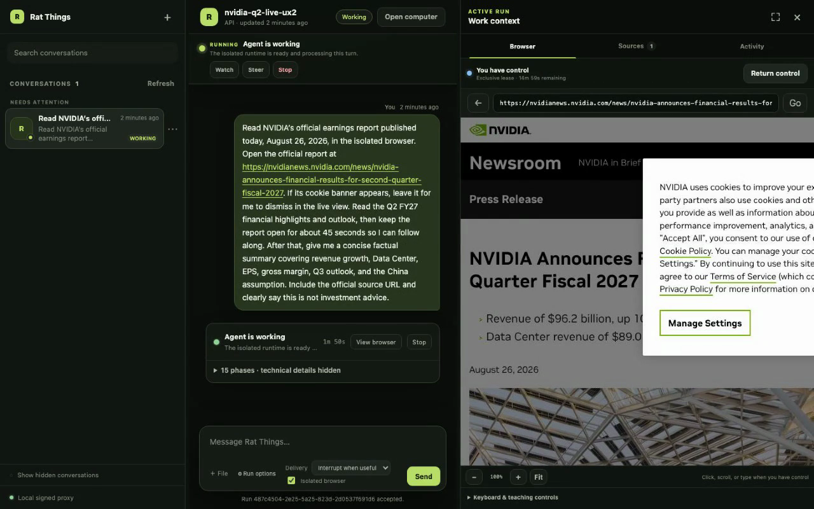

# Rat Things

<p align="center">
  
</p>

<p align="center">
  <strong>The open-source backend for cloud agents.</strong>
</p>

<p align="center">
  <a href="https://github.com/gpazo/Rat-Things/actions/workflows/ci.yml"></a>
  <a href="LICENSE"></a>
  
  
  
</p>

<p align="center">
  <a href="https://gpazo.github.io/Rat-Things/">Website</a> ·
  <a href="https://gpazo.github.io/Rat-Things/docs/">Documentation</a> ·
  <a href="docs/quickstart.md">AWS quickstart</a> ·
  <a href="docs/agents.md">Agent guide</a> ·
  <a href="https://gpazo.github.io/Rat-Things/llms.txt">llms.txt</a> ·
  <a href="docs/status-and-roadmap.md">Current status</a>
</p>

Rat Things is a self-hosted backend for running tool-capable agents in isolated AWS Lambda
MicroVMs. It gives products, CLIs, other agents, schedules, and signed provider events the same
owner-scoped API, reusable **Things**, durable **Runs**, conversations, and generated files.

There is no central Rat Things service. The host owns identity, OAuth applications, credentials,
data, infrastructure, and the user experience. Rat verifies connected accounts, resolves a fixed
capability envelope before each Run, and keeps provider secrets out of Thing definitions, Run
records, logs, and launch payloads.

> [!WARNING]
> Rat Things is an engineering preview. Its deterministic workflows and bounded real-Codex paths
> have passed disposable live-AWS validation, but the project has not completed a penetration test,
> sustained-load exercise, disaster-recovery proof, or untrusted multi-tenant hardening.

## Start with one path

### Try Codex locally

On a trusted device, use the official ChatGPT sign-in. This path does not copy a reusable account
credential into AWS:

```bash
npm ci
npm run codex:login
npm run rat-things -- local "Summarize this repository"
```

Read [Use your Codex subscription](docs/codex-subscription.md) for sandbox, authentication, and
headless-login details.

### Deploy the bounded AWS proof

With Node 22.20+, Git, Terraform, AWS credentials, Lambda MicroVM capacity, and Bedrock access ready:

```bash
git clone --depth 1 --branch golden-path-v1.0.0 https://github.com/gpazo/Rat-Things.git
cd Rat-Things
test "$(git rev-parse HEAD)" = "f1c5487f1eb0c1bbf778a75fea939f4474ee68ff"
npm run quickstart:aws -- \
  --profile rat-things-sandbox \
  --region us-west-2
```

The command performs a no-write preflight, deploys, tests an exact Thing draft, activates that
revision, runs it again, and retains evidence. The ten-minute measurement starts at
`quickstart:aws`; installing host tools and obtaining AWS quota/service access happens first. The
golden path intentionally leaves S3 Files, OAuth provider apps, schedules, and external sharing
unconfigured.

Use the saved deployment context to inspect or remove the same target:

```bash
npm run quickstart:aws -- status
npm run quickstart:aws -- destroy
```

Read the [AWS-ready quickstart](docs/quickstart.md) before using a privileged account.

## What Rat Things provides

- **Reusable Things** — test an immutable draft, then activate one exact revision for manual, rate,
  or cron execution.
- **Verified accounts** — connect several accounts per integration, derive their provider identity
  and authority, monitor health, reconnect the same identity without rebinding consumers, inspect
  “used by” dependencies, and narrow each grant before use.
- **Fixed permissions** — the deployment profile, provider authorization, account grant, Thing/Run
  selection, IAM, networking, operations, and resources intersect before launch. Inside the result
  the agent is autonomous; outside it, a tool is absent or denied. There is no mid-Run approval
  path.
- **Isolated tools** — shell, Git, filesystem, policy-controlled networking, and browser computer
  use run as an unprivileged process inside a dedicated Firecracker-backed guest. Owners can view
  the live browser, take temporary control, and turn a redacted demonstration into a draft Thing.
- **Durable conversations and files** — searchable transcripts, replies, reactions, questions,
  uploads, generated files, and lifecycle state survive clients and compute. With S3 Files enabled,
  replacement compute also restores the exact native Codex state and workspace.
- **One embeddable contract** — installed discovery, OpenAPI, JSON Schemas, integration manifests,
  capability profiles, and stable errors support CLIs, products, and other agents.

The local reference console exercises the public conversation, live-computer, connection, routine,
and Thing APIs; it is not a hosted product or a second execution path. Its resizable conversation
workspace keeps the list, transcript, active Run, isolated browser, collected sources, and
human-readable activity together. Dedicated Connections and Routines workspaces install verified
accounts, reconnect expiring credentials, change Rat-side access, disconnect credentials, create
schedules, and operate their lifecycle. Connection details show health, provider scopes, installed operations, stable aliases,
and dependent Things/routines without exposing credentials. Operators can watch, steer, stop, temporarily take browser control, and return control
without widening the Run's fixed capability envelope.

<p align="center">
  <a href="assets/conversation-console-live-browser.png"></a>
</p>

The workspace keeps a durable NVIDIA earnings conversation, the active Run, the isolated browser,
and temporary human takeover in one place.

### Connected services in the agent workspace

Rat Things turns a reviewed OAuth or API adapter into verified accounts and exact agent operations.
Those connections are not tied to one frontend: a product, CLI, Thing, Routine, another agent, or
team interface can use the same durable Run model. Today an operator can:

- install several accounts for one service and verify each provider identity before use;
- search and read admitted sources, then synthesize the results with browser, code, or file work;
- post, update, create, or trigger work through exact allowed provider operations;
- reuse a selected account across conversations, Things, Routines, the desktop, CLI, and API; and
- monitor health, reconnect the same identity, narrow access, and inspect every dependent consumer
  without exposing credentials to the agent.

Slack is one built-in end-to-end example: a mention can start an isolated Codex Run, delegated
search uses the installing user's visibility, and the answer returns to the same durable thread.
The source binding fixes the agent profile and connected accounts before launch. Provider scopes,
the persistent Rat grant, per-Run operation/resource narrowing, IAM, and egress still intersect; a
prompt cannot install an account or widen authority. See [Integrations, accounts, and
permissions](docs/plugins.md) for the reusable contract and [Use Rat Things from Slack](docs/slack.md)
for that provider's workflows and setup.

The CLI exposes the same durable conversation primitives without requiring the console:

```bash
rat-things conversations list
rat-things conversations search "NVIDIA earnings"
rat-things connect slack --oauth --wait --access read-write --alias slack-work
rat-things connection test slack-work
rat-things connection consumers slack-work
rat-things slack-events slack-work --profile read-only --json
rat-things routines list
rat-things conversation show PUBLIC_CONVERSATION_ID
rat-things chat --thread earnings --attach report.pdf --reply-to MESSAGE_ID \
  "Compare this with the previous quarter"
rat-things watch RUN_ID --follow
```

Slack installs through host-owned OAuth. Signed mentions can start durable conversations, replies
return to the source thread, and later messages continue the same context. The bot can post, reply,
and react, while delegated search uses the separately authorized installing user's visibility.
Operators manage account access and mention routing from the console or CLI; credentials remain in
Secrets Manager. See [Integrations, accounts, and permissions](docs/plugins.md#self-hosted-oauth-installation)
and [Channels and provider adapters](docs/channels.md#slack-self-hosted-channel-adapter).

List and search return an opaque public conversation ID for transcript, organization, reaction, and
source commands. `conversation sources` pages the complete indexed transcript, labels transcript
links as claims rather than verified visits, and reads durable files through the same opaque ID.
API-created conversations also return their caller-chosen thread key; use that key with
`chat --thread` to continue work. `watch` presents human-readable activity by default. A single
`--json` poll is one JSON document; `--follow --json` is JSONL snapshots; `--raw` is JSONL activity
cards. Follow mode treats the handoff from a finished MicroVM to durable Run history as normal
completion. Integration operation allow/deny flags accept either repeated values or comma-separated
operation IDs. The CLI rejects unknown options, extra fixed operands, and conflicting output modes
before making a request.

Run `npm run smoke:conversation-cli` for a safe automated verification of the advertised
conversation surface. It starts a disposable loopback fixture, exercises six black-box workflows,
prints their pass/fail names, and exits; it is not an interactive mock server and does not create AWS
resources.

## Mental model

| Term | Meaning |
| --- | --- |
| **Thing** | Reusable, revisioned agent definition without credentials |
| **Run** | One accepted asynchronous execution receipt |
| **Conversation** | Durable continuity boundary for related messages and files |
| **Thread** | Caller/provider key that selects a conversation |
| **Integration / account** | Human-facing external-service contract and one verified provider identity |

Every accepted path returns a Run:

```text
IAM API / signed event / schedule
              |
              v
  DynamoDB + encrypted S3 -> SQS -> trusted coordination
                                      |
                                      v
                         Lambda MicroVM + Codex
                                      |
                                      v
                    result + files + delivery
```

DynamoDB holds bounded coordination state and summaries. Encrypted S3 holds immutable prompts,
events, results, uploads, and generated files. Optional S3 Files mounts conversation-scoped native
Codex state and workspace bytes for replacement-compute restoration. Public projections omit owner
principals, storage coordinates, MicroVM IDs, native thread IDs, and credential bindings.

Read [How Rat Things operates](docs/operating-model.md), [Architecture](docs/architecture.md), and
[The capability envelope](docs/capability-envelope.md) for the complete model.

## Documentation by task

- [Deploy the AWS golden path](docs/quickstart.md)
- [Connect an agent to an existing deployment](docs/agents.md)
- [Build, test, activate, and schedule a Thing](docs/things.md)
- [Connect accounts and understand effective permission](docs/plugins.md)
- [Use durable conversations](docs/conversations.md)
- [Retain, view, and share files](docs/sharing-work.md)
- [Embed the API in another product](docs/embedding.md)
- [Operate and diagnose a deployment](docs/diagnostics.md)
- [Review the control API](docs/api.md)
- [Review security boundaries and production gates](docs/security.md)
- [Inspect current validation and known gaps](docs/status-and-roadmap.md)

Agents should begin with installed `/.well-known/rat-things`, then follow
[docs/agents.md](docs/agents.md). The generated [llms.txt](https://gpazo.github.io/Rat-Things/llms.txt)
is progressive and normative; competitive research and historical validation diaries are excluded
from the agent corpus.

## Develop and verify

```bash
npm ci
npm run check
npm run smoke:local
npm run test:e2e:localstack
```

`npm run check` enforces architecture direction, TypeScript, tests, packaging, generated-site links,
Terraform formatting, and validation. Lambda MicroVM provisioning and live AWS tests are explicit
opt-ins; ordinary tests do not create cloud resources.

Key directories:

```text
src/domain       stable contracts and state transitions
src/core         orchestration against ports
src/conversation durable mailbox and conversation services
src/runner       trusted runner and non-root agent launch
src/adapters     AWS and execution implementations
src/lambdas      transport adapters
infra/           reusable module plus development root
console/         local reference conversation client
docs/            human, agent, operator, and API guides
testing/         deterministic LocalStack and disposable AWS harnesses
```

See [Development, deployment, and migration](docs/development-and-deployment.md) and the
[operational runbook](docs/runbook.md) for deeper procedures.

## Security posture

The outer MicroVM is the isolation boundary. `danger-full-access` may be admitted inside that guest,
but it does not grant a new host identity, credential, network route, connected-account operation,
or AWS permission. Provider ingress, agent execution, and result delivery remain separate stages.

Before production use, complete the open gates in [Security and threat model](docs/security.md):
rate/concurrency/model budgets, output and destination policy, audited egress, failure drills,
release provenance, and an independent cross-owner/IAM/snapshot/repository/SSRF review.

## Name, provenance, and license

The name is inspired by the broad literary concept of semi-autonomous guard units in Neal
Stephenson's *Snow Crash*. The implementation is independent and is not affiliated with or endorsed
by Neal Stephenson or the novel's publishers. Upstream architectural references and notices are in
[`NOTICE`](NOTICE).

Licensed under the [MIT License](LICENSE).
