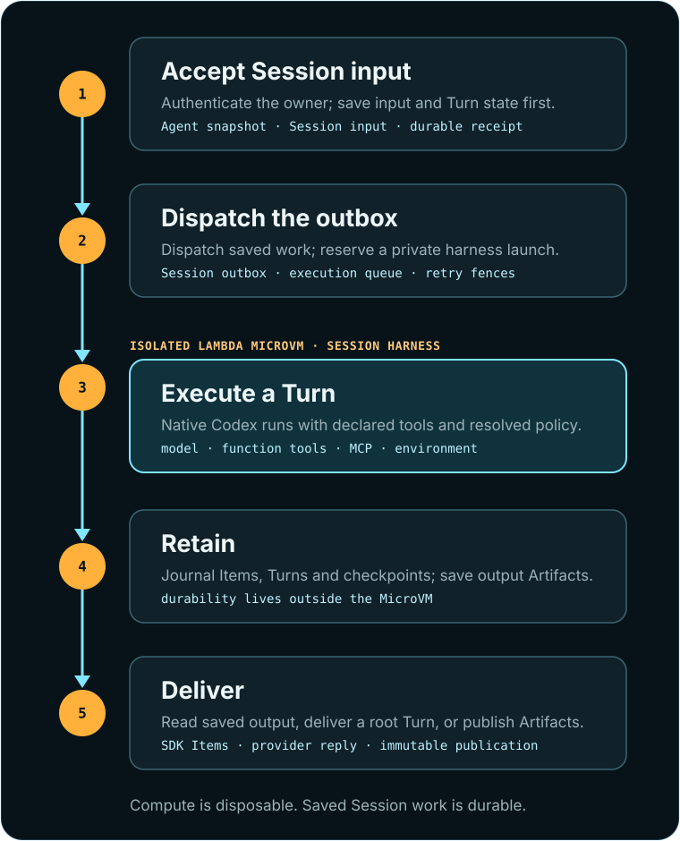

# Architecture

This page explains how Rat Things implements its product contract. Start with
[how Rat Things operates](operating-model.md) if you are connecting accounts, defining Things, or
building a consumer experience.

## Scope

Rat Things is an asynchronous agent subsystem. Its deployed webhook flow accepts a bounded,
versioned run request; assigns trusted ownership and provenance; schedules one isolated worker;
persists the result; and optionally posts that result to a channel. It also contains an AWS-backed
durable conversation foundation for prioritized messages, worker leases, progress, history, and
checkpointed turn slices. Signed Teams mentions enter that mailbox and wake the bounded slice
coordinator. The same control plane owns capability profiles, multi-account API connections,
live App Server interaction, isolated browser use, durable interval routines, and the revisioned
Thing facade for headless consumers. Rat Things is not
yet a general visual workflow builder, source-control installation manager, or chat identity
service.

## System promise

Rat Things separates the lifetime of accepted work from the lifetime of its compute:

- one Run is the durable acceptance, state, evidence, and result unit for every execution;
- an optional owner-scoped conversation adds mailbox ordering, replay, and workspace continuity to
  that same Run rather than creating another public execution object;
- DynamoDB owns coordination, fencing, ordering, and bounded history indexes;
- immutable S3 objects own Thing definitions, messages, events, checkpoints, results, and normalized replay;
- when enabled, S3 Files owns durable Codex state and workspace bytes expected by app-server, while high-churn
  temp, cache, plugin-cache, and exported-artifact paths remain VM-local;
- a Lambda MicroVM owns exactly one fenced conversation while it runs; and
- suspension is an optimization, not a mailbox durability boundary—with S3 Files enabled, a
  replacement VM can also restore the same Codex thread and workspace after the original is
  terminated.

This makes the execution layer serverless without reducing an agent to a stateless model call.

The code is divided by responsibility:

| Area | Responsibility |
| --- | --- |
| `src/domain` | Stable request/result types, validation, and the run state machine; no AWS imports |
| `src/core` | Submission, idempotency, ownership, cancellation, Things, routines, and orchestration through ports |
| `src/conversation` | Durable mailbox, lease, progress, history, and resumable-turn coordination |
| `src/identity` | Explicit actor, owner, source, and credential-subject context |
| `src/credentials` | Host-owned secret/vault contracts, credential bindings, and bounded extraction |
| `src/ingress` | Provider-neutral webhook lifecycle plus GitHub/GitLab/Teams/Slack adapters |
| `src/delivery` | Destination resolution, delivery lifecycle, and provider egress adapters |
| `src/execution` | Provider-neutral dispatch and execution-backend registry |
| `src/plugins` | Provider ingress/delivery manifests plus trusted agent-callable integration plugins, account policy, and profiles |
| `src/adapters` | DynamoDB, S3, SQS, EventBridge, Lambda MicroVMs, SSM, and Secrets Manager |
| `src/channels` | Pure provider payload normalization and signature helpers |
| `src/app` | Composition root that supplies host-owned ports to trusted built-in plugins |
| `src/lambdas` | Thin API Gateway, SQS, stream, and EventBridge transport adapters |
| `src/runner` | Trusted per-run orchestration, bidirectional App Server bridge, browser helper bridge, and the UID boundary around the model process |
| `infra/modules/agent-runner` | Reusable AWS infrastructure module |

`npm run architecture:check` rejects imports that reverse these dependencies. In particular,
provider plugins cannot import Lambda handlers, AWS adapters, the composition root, or the worker.

Provider modules depend on host-supplied contracts. Agent-callable integration adapters receive
only an authorized operation input, one connection's credential value, and an abort signal. See
[integrations and permissions](plugins.md).

Connection lifecycle calculations live in `src/plugins/connection-planning.ts` and
`connection-validation.ts`: account identity comparison, validated metadata and grants, alias
candidates, credential names, and health history. They operate on supplied values; the connection
service owns provider verification, alias lookups, IDs, clock reads, secret storage, and persistence.
Creation verifies the provider account and validates metadata and policy before storing its secret.
If the metadata bundle cannot be saved, the service attempts to revoke that secret and preserves
the original persistence error even if cleanup fails.

Rotation requires the same authentication scheme, tenant, and subject. It replaces the secret,
updates its binding, saves refreshed account metadata, and records health in that order. These
operations are not one transaction: a failed later write can leave the secret replaced. Health
checks retain the last success and failure times; provider downtime records degraded health
without expiring the account, while missing or rejected credentials require reauthentication.

Integration tool planning in `src/plugins/integration-tool-planning.ts` groups loaded connections,
selects eligible account defaults, projects tool schemas, and resolves call arguments. The runtime
keeps connection and grant reads in selection order and checks authorization during preparation
and again at invocation, so a grant that expires after preparation cannot authorize a later call.
`integration-tool-validation.ts` handles input shapes, resource constraints, and bounded JSON
results. Account and input validation precede invocation authorization; resource constraints are
checked before binding lookup and credential access. Result bounds are checked after the provider
operation returns, so an oversized result does not imply that the operation had no external effect.

HTTP integration calculations live in `src/plugins/http-planning.ts`: trusted base URLs, request
paths and bodies, header precedence, and response classification. The transport validates the URL
and body before invoking authorization, then performs the network request with cancellation and a
timeout. It reads the response under a byte limit and releases the reader before interpreting status
or invoking provider validation. Response plans distinguish parsed JSON, including `null`, `false`,
and `0`, from empty or plain-text responses. Provider validation runs only for parsed JSON and stays
at the transport boundary alongside authorization callbacks and network operations.

## One durable run

<figure class="doc-visual doc-visual-tall">
  <a href="durable-execution.svg"></a>
  <figcaption><strong>Compute is disposable; work is durable.</strong> Each stage has one responsibility and a recoverable boundary.</figcaption>
</figure>

## Lifecycle

### 1. Ingress and acceptance

`POST /v1/runs` uses the API Gateway-authorized principal. Public webhook routes first authenticate
the exact raw request with the provider-specific signature or secret, then normalize the provider
payload into the same v1 request. Only after authentication can a trusted source binding select an
owner-scoped capability profile or multi-account connection set; provider payloads cannot name
credentials or policy principals.

The submission service validates the normalized request, calculates its canonical request hash, and
stores the full body in S3. A small run record is conditionally inserted in DynamoDB before an SQS
wake-up message is sent. With an idempotency key, the run ID is deterministic within the owner
namespace: replaying the same body returns the existing run and re-nudges it when still queued;
reusing the key for a different body returns a conflict. If queue send fails, the durable record stays
`queued`; the same idempotent client retry or the one-minute reconciler repairs the wake-up.

Run admission calculations live in `src/core/run-planning.ts`: owner-scoped identity, queued record
construction, accepted-request comparison, and conversation preparation decisions. Trusted Thing
and conversation bindings are validated in `src/domain/run-bindings.ts`. These functions consume
supplied values; `RunService` obtains IDs and time and performs storage and queue operations.

Retry identity includes the accepted request and occurrence bindings. Conversation fields added
during preparation do not change that accepted identity. Retrying preparation of a queued Run
compares the full prepared binding and stored content digest. Once the Run has left the queue,
matching prepared state is reused before reading a new execution request. An idempotent submission
retry of a queued Run can repair a missing wake-up; a competing create that loses its conditional
write returns the winning record without sending another wake-up.

For a threaded input, the same service reserves the Run before appending its owner-scoped mailbox
item. The coordinator writes the replay transcript to `executionInput` while leaving the accepted
request in `input` immutable, then wakes that same Run. The reconciler repairs both the
Run-reserved/mailbox-write window and the prepared-Run/dispatcher-wake window. A thread therefore
changes preparation and retention, not admission or the public receipt.

Conversation message admission uses `src/conversation/validation.ts` for input contracts and
`message-planning.ts` for content identity, timing, and mailbox record construction. The service
supplies the clock value, stores the canonical message body, then validates trusted policies and
appends the records. Storage references connect the message, event, and transcript to that body;
receipt time remains distinct from the time the records were created.

Attachment calculations in `src/conversation/attachments.ts` normalize each upload, return a new
batch state, and build manifests and merged catalogs. The service checks ownership before handling
files and validates and writes one upload at a time. A later failure can leave earlier blobs stored;
the manifest is written only after all files pass validation and storage. Catalog merging rejects
conflicting records at an existing path, and the service publishes the merged catalog through a
conditional update using the current lease token.

Conversation coordination separates loaded values from external operations. Continuation
calculations pair each mailbox receipt with its content, compile bounded replay requests, and
build bindings from trusted conversation state. Transcript calculations interpret saved
interaction events and compact history with explicit omission evidence. Completion decisions
distinguish a saved result from an interrupted tool call whose external outcome remains unknown.
These calculations live in `src/conversation/continuation.ts`, `transcript.ts`, and `completion.ts`.

Public history uses `src/conversation/history-projection.ts` to format loaded transcript entries,
completion receipts, and reaction summaries. Pages retain their cursor even when a saved entry has
no visible message. Public attachment references contain opaque IDs, and completion receipts expose public Run
IDs and timing without private storage coordinates. `ConversationService` checks ownership before
loading the page, loads completion evidence before message bodies, and reads reactions only for
the resulting visible message IDs.

`src/conversation/search.ts` calculates normalized tokens and bounded search postings from supplied
text. A completed turn gives its last assistant message priority within the posting budget, then
indexes file paths in catalog order. Search calculations do not read artifacts or access the store.

The coordinators retain the effect ordering: prepare the Run before committing its mailbox
binding, commit that binding before waking execution, and suspend the worker before settling its
turn. Clock reads, storage, queue operations, and lease cleanup remain at that boundary. A failed
suspension leaves the turn active for retry; interrupted tools preserve a durable handoff and clear
native session resume. The native thread ID can otherwise survive VM expiry and restore into a
replacement worker.

Routines enter at the same boundary. Their prompts and canonical run requests live in encrypted S3;
the routine table stores schedule metadata, a digest, and an artifact reference. Each interval uses a
deterministic occurrence key, and the schedule advances conditionally only after ordinary run
submission succeeds.

Routine definitions and interval calculations live in `src/domain/routine-spec.ts`. They use
supplied validation policy and time, so resuming a due occurrence and advancing past a submitted
occurrence have explicit, distinct rules. `src/core/routine-planning.ts` constructs records,
compiles trusted occurrence identity, and summarizes committed advances, competing updates, and
failures. `RoutineService` verifies owner-scoped request references and digests, then processes each
due occurrence sequentially using one time snapshot for the batch. A failed occurrence remains due
for retry with the same key; other occurrences are still attempted before failures are reported.

Things are the product-facing entry to that boundary. The control API authenticates the owner,
validates a credential-free ThingSpec, writes an immutable content-digested revision to the private
definition bucket, and stores only lifecycle/index metadata in the Thing table. Explicit and
scheduled occurrences compile to ordinary RunRequests and add trusted Thing revision/provenance.
They do not bypass run idempotency, fixed capability-envelope resolution, connection grants, or
queue durability.

Thing calculations and external effects have separate boundaries. `src/domain/thing-spec.ts`
validates portable definitions and compiles them into RunRequests using explicit deployment
validation options. `src/core/thing-planning.ts` checks publish evidence, selects eligible scheduled
occurrences, and describes the required scheduler action from supplied records.
`src/core/thing-projection.ts` builds public summaries and explanations from loaded values.

`ThingService` obtains IDs and timestamps, loads and verifies definitions, and performs the
resulting operations through ports. It commits lifecycle changes conditionally before changing a
schedule and records trigger readiness only after scheduler synchronization succeeds. The pure
decisions do not reserve work or guarantee that a previously read record is still current; the
conditional writes remain responsible for resolving races.

### 2. Dispatch

The SQS dispatcher loads the canonical request from S3 and conditionally advances the run:

```text
queued -> dispatching -> running -> succeeded
   |           |           |
   +-----------+-----------+----> failed
   |           |
   |           +----> cancelling -> cancelled
   +-----------------------------> cancelled
```

Conditional DynamoDB writes make stale or duplicate deliveries harmless at the state-transition
boundary. This does not make arbitrary external side effects exactly once.

`src/execution/dispatch-planning.ts` decides whether a loaded Run can dispatch and classifies
executor start failures. Unprepared conversation Runs wait for continuation input; queued Runs and
unattached dispatch retries retain their existing admission behavior. Executor selection precedes
the conditional claim. A failed attachment stops the launched execution before rereading a raced
cancellation, and transient start failures return to queue retry without marking the Run failed.

The dispatcher chooses `execution.backend`, or the deployment default, and starts one execution. It
passes identifiers and storage coordinates, not the prompt or a provider token. The worker loads and
revalidates the stored request. Before it starts the agent, the worker waits up to 60 seconds for the
dispatcher to attach the MicroVM ID to the durable record. This makes cancellation
targetable before untrusted work begins and fails closed if launch succeeded but attachment cannot
be repaired.

### 3. Isolated execution

Trusted worker orchestration creates an isolated per-run workspace and clones an allowlisted,
credential-free HTTPS repository when requested. It resolves the clone credential only for the Git
subprocess. In default ChatGPT mode, it resolves the operator-consented auth-file secret, validates
it, and materializes a private Codex-home copy; in optional Bedrock mode it mints a short-term
bearer token from the execution role (or resolves an explicitly configured Bedrock key). The root
lifecycle server launches the trusted runner with the execution-role environment; the runner hands
the workspace to UID 10001 and launches Codex App
Server as that identity with a sanitized environment. It speaks App Server's bidirectional JSON-RPC protocol: initialize, thread
start/resume, turn start, streamed notifications, server requests, steering, interruption, and
completion. The deterministic mock driver implements the same internal execution interface for
tests.

Workspace calculations validate resolved paths and repository hosts, construct Git argument arrays,
and build child environments from supplied settings. Preparation executes the commands in order,
reading credentials after directory handoff. A reusable checkout skips initialization; first-use
durable cleanup preserves the managed artifact directory. Patch capture stages and diffs with
separate output limits while excluding `.rat-things/` control files. File access, credential reads,
environment reads, and process execution stay in workspace orchestration.

Launch planning combines the admitted Run request with explicit deployment settings to select the
model provider, child environment, process identity, sandbox, and persistent thread. An explicit
network restriction narrows `danger-full-access` to `workspace-write`, which can enforce that
restriction. Planning validates settings before process execution and builds a fresh child
environment without changing the supplied values. The driver supplies current deployment settings,
attaches cancellation and interaction callbacks, then executes the plan.

Before the turn, the runner resolves the requested capability profile against the deployment
ceiling. Installed skills are verified with `skills/list`; app and MCP configuration is attached to
the thread; and authorized integration operations plus optional browser computer use are registered
as dynamic tools. App Server's experimental capability flag is enabled only when dynamic tools are
present.

Integration operations follow the [capability envelope](capability-envelope.md). The broker checks
each call before reading its selected connection secret. The model sees account aliases and JSON
schemas, never credential values or Secrets Manager references.

Browser computer use runs in a separate unprivileged Chromium helper process. It preserves a
conversation-local profile, blocks loopback/private/link-local/metadata destinations and redirects,
rejects downloads and popups, and returns bounded DOM snapshots/screenshots. Once browser use and
network access are admitted, navigation, observation, click, type, press, and select run
autonomously. This protects infrastructure destinations, but broad public-web
egress can still disclose information to an attacker-controlled public site.

The runner pins Codex App Server to `approvalPolicy: "never"` and rejects approval-shaped requests.

The child receives a small environment allowlist. In ChatGPT mode it reads the mode-`0600`
`${CODEX_HOME}/auth.json` that Codex requires; in Bedrock mode it receives only
`AWS_BEARER_TOKEN_BEDROCK` for model access. Same-UID repository code can read the ChatGPT file, so
that bridge is only for trusted owner-operated agents. `ALLOW_AGENT_AWS_CREDENTIAL_CHAIN=true` is
an explicit local/exception escape hatch and must remain false in production. Process separation
reduces other credential exposure, but it does not replace the outer MicroVM, IAM, and egress
boundaries.

The worker writes:

- `result.md`, the complete final response;
- `events.jsonl`, the driver's event stream;
- `workspace.patch`, only when the checkout changed; and
- a bounded result preview and execution metadata in DynamoDB.

It then commits terminal state in DynamoDB. A DynamoDB Streams Lambda turns each state change into an
`Agent Run State` event on EventBridge. This narrows the worker-state-commit/event-publish crash
window because the stream is independent of the worker, but it is not a permanent outbox: the
current event-source mapping accepts records for up to 24 hours and retries a failed batch ten times.
Exhausted invocations go to an encrypted SQS failure destination with an alarm, but replay remains an
operator action. Workspaces are deleted at worker exit.

### 4. Live interaction

The runner forwards App Server notifications and server-initiated requests over its private IPC
channel to the root lifecycle server. That server maintains a bounded, sequence-numbered event ring,
the current thread/turn IDs, and outstanding request IDs for the active run. It exposes these only on
its private port-8080 control routes.

The IAM-authenticated control Lambda first proves run ownership and resolves the exact attached
MicroVM. It then asks AWS for a five-minute, port-scoped proxy token and forwards event polling,
steering, interruption, or ordinary response commands. The lifecycle server forwards commands to
the exact runner IPC channel and waits for acknowledgement. Neither API callers nor the agent child
receive the raw MicroVM endpoint or proxy token. Terminal event JSONL remains the durable record;
the live ring is intentionally ephemeral.

### 5. Delivery

The notifier reacts only to terminal EventBridge states. It resolves `source` destinations using the
trusted stored source metadata, then posts through the appropriate provider adapter. A per-run,
per-destination DynamoDB fence suppresses ordinary duplicate delivery. A confirmed retryable
non-delivery releases the fence for EventBridge retry. Missing configuration and permanent provider
rejections are recorded as `not_delivered`; an ambiguous outcome is retained as
`outcome_unknown` to avoid a blind duplicate post. A `sending` claim has a 120-second lease: event
redelivery while it is live fails for another EventBridge retry, and an expired lease is
conditionally reclaimed. This closes a permanent-stuck window, but a crash after the provider
accepted a post and before `delivered` was recorded can still cause a duplicate after lease reclaim.
Operators must reconcile `outcome_unknown` states against the provider before an audited retry.

The EventBridge notifier target retries failed invocations up to 185 times over 24 hours. Exhausted
events go to a separate encrypted SQS dead-letter queue, with alarms both for visible DLQ messages and
failure to write the DLQ. Redrive is an operator action.

This is an explicit best-effort delivery policy, not a claim of exactly-once messaging.

## Lambda MicroVM execution

Lambda MicroVM is the only remote execution backend:

| Property | Behavior |
| --- | --- |
| Provisioned unit | Lambda MicroVM image using a pinned managed base-image version |
| Isolation boundary | One Firecracker-backed guest kernel and MicroVM per active run/session |
| First slice | `RunMicrovm` with a bounded `runHookPayload` containing run/storage IDs |
| Later conversation slices | `ResumeMicrovm`, short-lived endpoint token, then authenticated port-8080 request |
| Runtime unit | One disposable VM per one-shot run or one suspended/resumable VM per bounded conversation session |
| Network | AWS-managed public egress for one-shot runs; S3 Files conversations use a dedicated VPC connector and NAT egress |
| Durable filesystem | Per-conversation S3 Files directory containing Codex home/SQLite state and workspace bytes |
| Idle lifecycle | Conversation VMs suspend; one-shot VMs terminate; expiry creates a fresh VM with S3 Files plus normalized replay |
| Cancellation/cleanup | `SuspendMicrovm` or `TerminateMicrovm` by exact MicroVM ID |

### Why this execution boundary

Lambda MicroVMs combine capabilities that previously required choosing between different operating
models: dedicated VM-level isolation, snapshot-based launch/resume, retained session state, and
Lambda-managed lifecycle. AWS positions the primitive specifically for multi-tenant systems that
execute user- or AI-generated code. The same tradeoff is the central theme in this [r/aws community
discussion](https://www.reddit.com/r/aws/comments/1ueul5o/hardest_problems_lambda_microvms_can_solve_now/).

Those properties map directly to agent execution:

- repository bytes, prompts, generated code, and tool commands are treated as untrusted;
- a dedicated guest kernel reduces cross-session blast radius compared with a shared process or
  application-container boundary;
- a pre-initialized image avoids rebuilding the tool environment for every turn;
- suspend/resume preserves a responsive interactive session without keeping it continuously active;
- termination by exact MicroVM ID provides a forceful backend boundary when guest work does not
  cooperate; and
- Lambda functions, SQS, DynamoDB, and EventBridge remain the event-driven control plane rather
  than an always-on scheduler fleet.

These properties do not make arbitrary agent work safe by themselves. IAM scope, egress policy,
credential handling, resource budgets, output projection, and destination authorization remain
separate controls. See the [AWS Lambda MicroVM launch
post](https://aws.amazon.com/blogs/aws/run-isolated-sandboxes-with-full-lifecycle-control-aws-lambda-introduces-microvms/)
and [security model](security.md).

### Three layers of continuity

Rat Things uses three deliberately different state layers:

1. A suspended MicroVM preserves memory, disk, and running processes for fast continuation within
   AWS's bounded session lifetime.
2. S3 Files preserves Codex app-server state and workspace bytes across MicroVM replacement.
3. The normalized DynamoDB/S3 archive preserves messages, events, checkpoints, summaries, and
   results independently of Codex's native storage format.

The first layer optimizes latency. The latter two provide durability beyond one VM's lifetime.
VM-local caches survive suspend/resume on the same MicroVM but are deliberately reconstructible on
replacement. The artifact outbox is restored from and committed back to the immutable S3 catalog,
so its local staging bytes are not part of the S3 Files durability boundary.

There is no always-on agent service. The image listens on port 8080 for lifecycle hooks and a
service-authenticated continuation endpoint exposed only by the AWS-managed ingress connector. The
coordinator mints a short-lived MicroVM auth token for that exact endpoint and port; callers do not
receive it. The service builds a managed image from an S3 bundle containing a
Dockerfile and artifacts, captures a snapshot, and invokes those lifecycle hooks inside the VM. Its
image, managed connector, execution role, logging, duration, and hook semantics follow the
[Lambda MicroVM images](https://docs.aws.amazon.com/lambda/latest/dg/microvms-images.html),
[networking](https://docs.aws.amazon.com/lambda/latest/dg/microvms-networking.html), and
[`RunMicrovm` API](https://docs.aws.amazon.com/lambda/latest/microvm-api/API_RunMicrovm.html)
documentation.

The image treats each `/run` hook as fresh one-shot work and each authenticated continuation as a
serialized slice of the same conversation. Never capture secrets or workload state in the reusable
image snapshot. A running VM's connector cannot be changed. A suspended session may preserve disk
and memory for up to eight hours. With S3 Files enabled, a replacement VM mounts the conversation's
Codex home and workspace; DynamoDB fencing prevents simultaneous SQLite access. Normalized artifact
replay starts a successor Codex thread only when app-server explicitly reports that the requested
thread has no persisted rollout. Invalid requests, configuration failures, and internal app-server
errors fail the Run instead of silently discarding native continuity. The low-cardinality
`CodexThreadResumeFallback` metric records each successor-thread fallback. See the AWS
[snapshot guidance](https://docs.aws.amazon.com/lambda/latest/dg/microvms-images-snapshots.html).

AWS SDK clients own transient-error classification, throttling backoff, and request retries. Rat
Things does not wrap them in a second retry policy. Adapters instead normalize successful cleanup
postconditions: a released conditional lease, absent multipart upload, or secret already scheduled
for deletion is complete. If compensating cleanup still fails after the SDK returns, the primary
operation result is preserved and a sanitized `CleanupFailure` metric is emitted. Expiring leases
and bucket lifecycle rules remain bounded recovery mechanisms rather than application retry loops.

AWS launched Lambda MicroVMs with an initial limited Region set. Confirm current availability before
selecting a deployment Region. Terraform requires MicroVM provisioning because there is no fallback
execution backend.

## Data and control boundaries

### DynamoDB

The run table contains state, owner, timestamps, hashes, artifact references, bounded previews, and
delivery-fence items. It is not a prompt, transcript, token, or repository-content store. Runs
default to a 30-day TTL; deletion occurs asynchronously after expiry.

The separate conversation table contains one hashed partition per conversation with metadata,
pending message projections, turn state, renewable leases, and append-only history records. A GSI
orders `interrupt` work ahead of `defer` work. DynamoDB transactions fence mutations by lease token
and keep message consumption, pending counts, and history consistent. See
[durable conversations](conversations.md).

The integrations table stores owner-scoped connection metadata, host-only credential bindings,
persistent grants, connection sets, and source bindings. It never stores credential values. A
separate routines table stores interval schedules and encrypted request references; a due-time GSI
lets the one-minute reconciler find enabled occurrences without scanning prompts or runs.

The Thing table stores one root lifecycle item and immutable version references per Thing. The root
has separate draft and active revision pointers plus observable trigger synchronization state; the
owner-created GSI indexes only root items. Compare-and-swap on the draft pointer prevents two
editors from silently overwriting each other. Production runs and Scheduler deliveries load only
the active pointer, so editing cannot silently change live behavior.

### S3

S3 is the durable definition/body/artifact plane. The separate definition bucket holds encrypted,
versioned Thing revisions without the run-artifact expiry rule. The artifact bucket holds prompts,
full results, event streams, patches, conversation message bodies, history payloads, turn
checkpoints, and user-visible files under owner-hashed prefixes with checksums. Runner finalization
saves partial output, events, and a bounded file catalog for succeeded, cancelled, and failed agent
turns. The terminal write is fenced by the
exact execution generation; a stale worker cannot finalize a replacement execution. The completion
coordinator folds available evidence into conversation history and the file catalog, preserving
unknown-external-outcome recovery rules. Abrupt VM loss or finalization failure can still leave only
the prior committed catalog. The runner restores catalog files into `.rat-things/artifacts/` before
execution, so a new MicroVM does not depend on residual local bytes. Bucket encryption, public-access blocking, and
lifecycle policy are deployment responsibilities. An S3 reference is sensitive metadata and the
control API should remain authenticated.

Runner artifact planning takes observed file sizes, checksums, content samples, and prior catalog
entries as values. It decides whether to upload bytes or renew a stored copy, preserving the previous
metadata when a file's path, size, and checksum are unchanged. The runner retains file access,
environment and clock reads, and sequential storage operations. It checks each stored checksum
before making that blob available for reuse by later files in the batch. A later failure can leave
earlier uploads stored without committing a new catalog; restoration similarly retains earlier
restored files while removing the failed file's temporary output.

The [publication layer](publications.md) turns retained files into immutable file, site, or video
publications. Owner-authorized, expiring grants provide browser access on isolated origins while S3
remains private. Without publication delivery, the control API provides
[one-minute download URLs](durable-files.md).

Publication builders calculate file selection, viewer bytes, and bundle paths without storage
access. Catalog planning validates owner scope and derives a content identity from the requested
specification and selected files. The publication service validates the complete plan, stages files
in order, and commits the manifest as the ready marker. Manifest construction takes staged references
and an explicit timestamp without rearranging the caller's file array. The publisher creates a fresh
expiring grant after that commit; retrying a failed grant can reuse the committed bundle. Storage,
clock reads, and random token generation stay at these service boundaries.

When `enable_s3_files=true`, a separate versioned bucket backs an S3 Files filesystem. Its access
point exposes only `/conversations` to the MicroVM execution role. Each hashed conversation owns a
`codex-home` directory (including Codex's SQLite state) and a `workspace` directory. The lifecycle
server overlays Codex temp/cache/plugin-cache directories and `.rat-things/artifacts/` with local
bind mounts. This keeps reconstructible churn and large output staging out of S3 Files while leaving
thread state and project files replacement-VM durable. The durable mount remains distinct from the
immutable artifact/checkpoint records above.

### SQS and EventBridge

SQS wakes the dispatcher; it is not the canonical request store. A scheduled reconciler re-nudges
stale queued runs and stale dispatching/running records that have no attached execution handle, and
finalizes stale cancellations that never launched. Backend start uses the run ID as the MicroVM
client token, so recovering a dispatcher crash after launch does not intentionally create a second
execution. DynamoDB Streams are the durable source of state changes, and EventBridge carries their
bounded notifications; neither bus is the full result store. Stream-to-EventBridge retry is finite,
so exhausted invocations are retained in an encrypted SQS failure queue and alarmed for operator
replay. EventBridge-to-notifier retry is also finite and has its own encrypted, alarmed dead-letter
queue. Redelivery is expected, which is why state transitions and delivery fences are conditional.
The separate conversation queue follows the same rule: the mailbox is canonical. Its coordinator
attaches a deterministic run before waking the run queue, and a duplicate wake repairs a missed
enqueue without creating a second semantic slice.

Attached-worker recovery uses `src/execution/reconciliation-planning.ts` to select an observation,
stop request, cancellation, or lost-execution failure from supplied Run state and inspection
evidence. Unknown or conflicting identity always produces an observation, including during
cancellation. Repeated matching uncertainty can quarantine the attachment; a changed uncertainty
kind resets the count. The reconciler performs inspection and conditional persistence, reads time
only when recording an observation, and treats a lost conditional write as a race rather than a
successful repair. Confirmed terminal or absent executions can finish cancellation; an active or
inactive attached worker must first receive a stop request.

Thing schedules do not use that polling reconciler. Publishing a `schedule` trigger creates or
updates one Amazon EventBridge Scheduler resource in a deployment-owned group. The control plane
fixes its Lambda target, narrowly scoped invocation role, retry policy, and encrypted failure queue.
The payload pins the Thing ID, active revision, and Scheduler-provided scheduled time. The target
acknowledges stale revisions and paused/archived Things without a run; accepted duplicate delivery
converges on one semantic run ID. Pause disables the resource, resume re-synchronizes it, and
archive deletes it. The root `triggerState` makes cross-service synchronization failure visible and
safe to retry.

### Secrets Manager and SSM

Secrets Manager stores webhook authenticators, repository/provider credentials, integration account
credentials, the file-based ChatGPT login, the scoped Bedrock API key, and outbound channel
URLs/tokens. SSM parameters hold the
non-secret provisioned MicroVM image ARN/version. MicroVM launch payloads receive only IDs and
resource coordinates, including a Codex credential secret ARN but never its value. Trusted
orchestration resolves clone/model material before launching the unprivileged agent child. It saves
validated ChatGPT refresh rotation back to the same secret and removes the runtime file after the
turn. Integration credentials are read one account at a time only after tool authorization;
notification credentials remain in the notifier.

Hosted OAuth calculations live in `src/plugins/oauth-planning.ts` and
`oauth-token-planning.ts`: authorization records and URLs, token request encoding, response
validation, and expiry decisions use explicit values. `src/credentials/oauth-application.ts`
validates loaded application credentials. The OAuth service keeps secret reads, randomness, clock
reads, callback-state consumption, and network requests at the boundary. Callback state is consumed
before exchanging a code, so a failed or declined callback cannot be replayed. The refresh broker
holds one connection lease while refreshing primary and delegated tokens in order, replaces the
stored credential only after all required exchanges succeed, and releases its lease on failure.

## Identity model

Keep these namespaces independent:

| Identity | Examples | Decides | Must not decide |
| --- | --- | --- | --- |
| Actor | API principal, provider sender, or verified system event | Attribution retained in run provenance | Run ownership or provider credentials |
| Owner | API IAM principal (or a separately maintained adapter's JWT `sub`), GitHub installation/org, GitLab project, Teams tenant+sender | Run visibility and idempotency namespace | Destination or credential authority |
| Source | API, GitHub delivery, GitLab event, Teams activity, Slack event | Trusted trigger provenance and source reply resolution | Ownership by itself |
| Destination | `source`, Teams route name, Slack channel | Where a terminal result is attempted | Run ownership or credential contents |
| Credential subject | API actor or deployment runtime | Which host-owned authority may be considered | Destination, ownership, or secret value |
| Credential | MicroVM execution role, a Secrets Manager ARN | What an adapter may access or call | Actor, owner, source, or arbitrary destination |

The control endpoint overwrites any client-provided `source` with an API source; the per-attempt API
Gateway request ID remains queue trace metadata so it cannot change the idempotent request hash.
Webhook sources and provenance are created only after signature validation. Routes are opaque
delivery configuration keys, never secret values.

## Deliberate current limits

- Live App Server events use owner-checked polling rather than push streaming and are retained only
  in a bounded in-MicroVM ring until terminal artifacts are committed. Steering, interruption, and
  ordinary input responses work during an active turn; a queued conversation `interrupt` message still becomes
  input at the next safe slice boundary.
  Host-recorded questions, non-secret answers, and acknowledged steering are folded into one
  S3-backed terminal transcript record, exposed as nested interactions without expanding page size.
  Guest-supplied events cannot impersonate those host interaction records.
- Connections accept API keys/already-issued tokens and optional self-hosted authorization-code/PKCE
  installation. OAuth app secrets stay in Secrets Manager; one-time callback state and refresh
  leases stay in DynamoDB; expiring tokens refresh behind the host broker. There is no public
  marketplace, visual field mapper, polling trigger engine, or dynamic package loader. Integration
  code remains reviewed, trusted, and image-bundled.
- Browser computer use is isolated public-web automation, not arbitrary desktop control. The
  owner-scoped API can stream bounded screenshots, transfer a renewable exclusive browser lease,
  and compile a redacted demonstration into an unpublished Thing draft without exposing Chromium
  directly. It blocks obvious local/private/metadata targets and does not provide content DLP or
  make attacker-controlled public origins trustworthy.
- Routines support interval schedules only. They skip backlog and reuse ordinary run semantics; they
  do not yet provide event triggers, branching workflows, calendars, or retries of failed agent
  work. Rat Things deliberately has no asynchronous human-approval queue.
- LocalStack validates persistent-session selection and durable replay, not the Lambda MicroVM
  suspend/resume APIs or endpoint auth. The disposable AWS suite covers that continuation path,
  including retained workspace bytes, real Codex thread resume, expiry fallback, and crash repair.
- Every newly attached execution has a generation token. The worker conditionally heartbeats only
  while Run ID, MicroVM ID, generation, and `running` status still match; heartbeat writes do not
  change semantic `updatedAt`. After two missed windows, the reconciler describes the MicroVM and
  calls a root-owned health route that proves the exact supervised worker generation. A dead exact
  attachment becomes retryable `execution_lost`; ambiguous identity is quarantined and never
  terminated automatically. There is still no automatic semantic retry: a new attempt requires a
  new Run submission.
- Cancellation is cooperative at the worker and forceful at the backend; it is not guaranteed to
  retract an external side effect already made by an agent or notifier.
- The GitHub/GitLab webhook prompts include untrusted issue content. Comment runs require the
  configured trigger (`@rat-things` by default), but trigger text is not authorization. The outer
  task/VM, child identity/environment, network, and sandbox boundaries must assume prompt injection
  succeeds.
- GitHub/GitLab comment runs require a non-empty trigger. Provider result replies carry a hidden
  runtime marker, and normalization ignores marked replies plus GitHub `Bot`/GitLab bot authors to
  prevent ordinary self-trigger loops. These are loop/noise controls, not author authorization or a
  substitute for repository, budget, and rate policy.
- Teams currently uses outgoing-webhook ingress and Workflow-URL egress. The production Teams bot
  gateway described in [channels](channels.md) is roadmap work.
