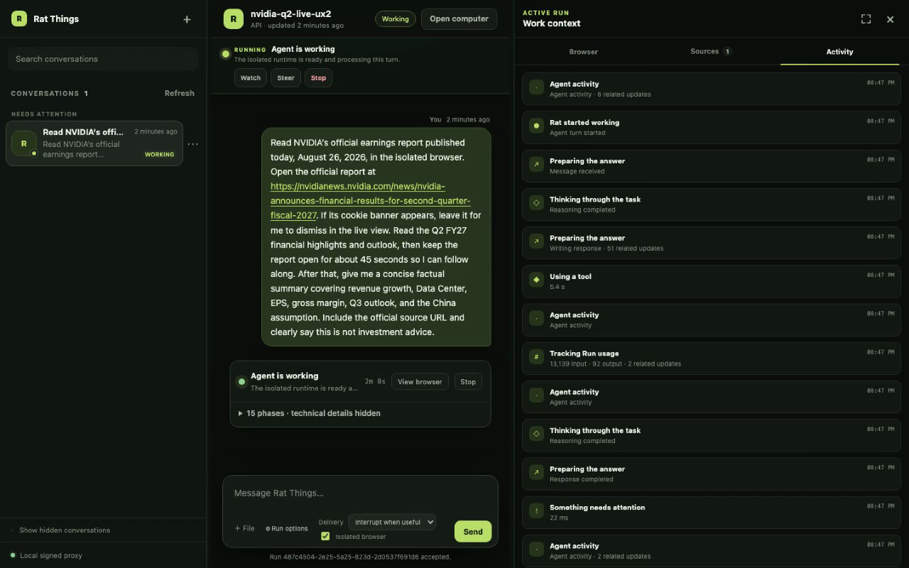
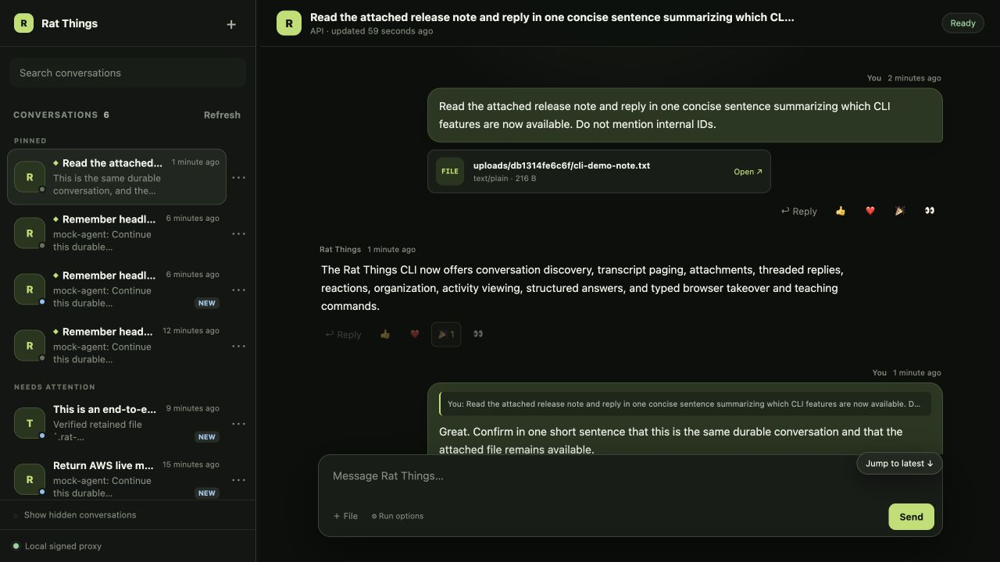
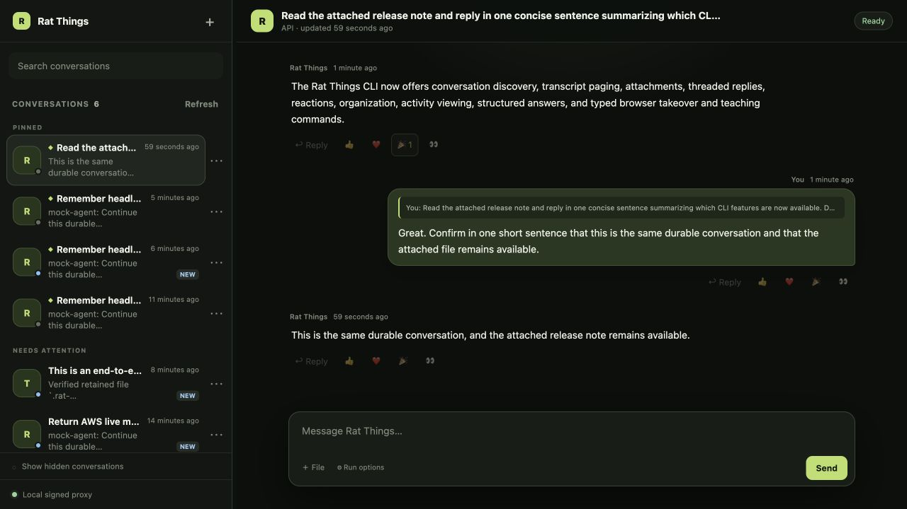
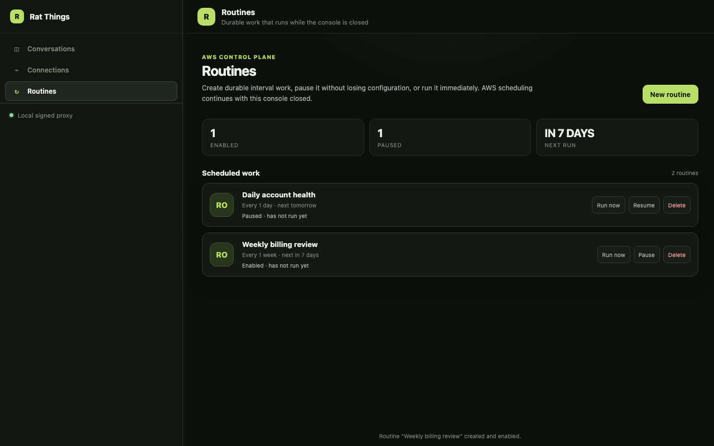

# Durable conversations

Rat Things conversations keep multi-turn work available after a browser, CLI process, or MicroVM
goes away. The public API and local test console let an authenticated owner:

- start or continue a named conversation;
- search and page its transcript;
- attach files, target a reply, and add a reaction;
- answer questions that provide information without granting permission;
- inspect generated files through an owner-gated viewer; and
- interrupt active work, then continue later through the same durable Run model.

See [Connect an agent to Rat Things](agents.md) for the smallest machine-facing journey and the
[Control API reference](api.md#headless-durable-conversations) for exact routes. The console is a
reference client for those routes, not a hosted product or a second backend.

In an empty console, type a message and send it to start work immediately. To choose a display
name first, use **New conversation**; names can contain spaces and punctuation. The console generates
the routing key separately. After acceptance, reload reopens the durable conversation and resumes
tracking its Run, including while the coordinator is still preparing execution.

If a submission response is lost, send the unchanged message again. The console retains the exact
request and idempotency key, including attachments, in this browser's local IndexedDB until acceptance
is confirmed. Reload preserves that retry. Changing the message creates a new submission; clearing
browser storage removes the saved retry envelope. API and CLI clients must likewise reuse their
original key and request when acceptance is uncertain.

On desktop, draggable separators resize the conversation list, transcript, and context pane. The
active-Run strip keeps phase, progress, elapsed time, Watch, Steer, and Stop visible. Opening Watch
places the isolated browser beside the transcript; Sources and grouped Activity share that context
pane. At compact widths, the same context becomes a full-screen sheet and the hidden workspace is
removed from keyboard and assistive-technology navigation.



The CLI opens the signed loopback client directly on either surface:

```bash
rat-things computer open --thread THREAD_NAME
rat-things computer open --run RUN_ID
```

## How durability works

The provider-neutral persistence model uses DynamoDB as a bounded coordination plane and encrypted
S3 for immutable message bodies, events, checkpoints, results, uploads, and generated files. When
S3 Files is enabled, it also mounts durable native Codex state and workspace bytes so replacement
compute can restore them exactly.

Every accepted input first becomes one durable Run. When `POST /v1/runs` includes `thread.key`, or a
verified provider event maps to a thread, trusted orchestration binds that same Run to the mailbox
and sends an SQS wake-up. A coordinator attaches replayable context as `executionInput`, resumes a
suspended MicroVM and Codex thread when possible, and folds terminal output back into history. With
no thread binding, the same Run wakes the dispatcher directly. There is one public receipt and one
Run lifecycle in both cases.

## Conversation identity and concurrency

The provider's existing thread is the user-facing conversation boundary. In Microsoft Teams, a new
top-level post starts a new Rat Things conversation and replies in that thread add turns to it. No
session command or special `new:` syntax is required.

Different provider threads use different DynamoDB partitions and, when S3 Files is enabled,
different filesystem directories, so they may run concurrently. Turns within one thread are
serialized. A fenced DynamoDB lease ensures that only one MicroVM at a time owns the conversation
and opens its Codex SQLite state.

## Invariants

- The mailbox, not SQS, is the source of truth. Queue messages only wake a coordinator.
- Each conversation has at most one renewable worker lease and one active turn.
- The lease fences filesystem ownership: only one MicroVM may mount and open a conversation's Codex
  SQLite state at a time. Different conversations remain independently concurrent.
- Every mutating turn operation is fenced by the current lease token.
- `interrupt` messages sort ahead of `defer` messages without losing arrival order within a class.
- Checkpointing moves a turn to `awaiting_resume` and releases its lease. Another worker can acquire
  a new lease and resume the same turn at the next slice.
- DynamoDB stores only bounded records and previews. Full message bodies, event payloads,
  checkpoints, results, and published files live in S3 behind checksummed references.
- `.rat-things/artifacts/` is reconciled from the committed conversation catalog before each run.
  Successful runner finalization retains available files on completed, stopped, and failed turns.
  If the runner cannot finish cleanup or the VM is lost abruptly, only the last committed catalog
  is guaranteed to survive; a terminal status alone does not prove new files were saved.
- User attachments are checksummed into the same encrypted artifact store, bound to the accepted
  Run by a private manifest, and merged into the catalog while the coordinator holds the lease.
  They are therefore available at `.rat-things/artifacts/uploads/...` even after crash repair or a
  replacement MicroVM; base64 transport bytes and S3 coordinates never enter the public transcript.
- Provider source, destination, actor, owner, and credential-subject contexts remain distinct.
- A run is attached to its turn before its dispatcher wake-up. A repeated conversation wake repairs
  the attach/enqueue crash window without creating a second semantic run.
- A terminal conversation VM is suspended before the turn is finalized, so failed suspension is
  retryable while the turn remains active.

## AWS mapping

| Conversation concern | AWS representation |
| --- | --- |
| Mailbox and conversation state | One DynamoDB partition per hashed conversation ID |
| Message priority | `conversation-work-index`, ordered by delivery class, time, and message hash |
| Owner conversation list | `owner-created-index`, newest first; opaque API IDs are conversation hashes |
| Worker ownership | Lease token and expiry on the conversation metadata item |
| Active turn and resume slice | Durable turn item in the same partition |
| Coordinator wake-up | Encrypted SQS queue plus Lambda event-source mapping |
| Execution continuation | Expiring MicroVM ID/state plus durable Codex thread ID on conversation metadata |
| Native Codex/workspace state | S3 Files access point rooted at a SHA-256 conversation directory; temp/cache/outbox paths are VM-local |
| Published file continuity | Immutable S3 objects plus a catalog reference on conversation metadata |
| History and progress index | Append-only event items with bounded previews |
| Message/event/checkpoint/result bodies | Content-addressed objects in the encrypted artifact bucket |
| Retention | DynamoDB TTL plus the artifact bucket lifecycle policy |

The conversation table is separate from the run table. The run table's stream drives terminal
delivery, so mixing mailbox events into it would couple conversation coordination to result egress.

## Item and object layout

The physical DynamoDB key does not expose a provider conversation ID:

```text
pk = CONVERSATION#sha256(conversationId)

META
MAILBOX#sha256(messageId)
TURN#sha256(turnId)
EVENT#occurredAt#sha256(eventId)
REACTION#sha256(messageId)#sha256(emoji)#sha256(ownerId)
```

Pending message items project these attributes into `conversation-work-index`:

```text
workPartition = CONVERSATION#sha256(conversationId)
workOrder     = 0|1#createdAt#sha256(messageId)
```

`0` means `interrupt`; `1` means `defer`. Consuming a message removes both index attributes in the
same transaction that decrements `pendingCount` and appends the consumption event.

S3 objects use owner- and conversation-hashed prefixes:

```text
owners/<owner-hash>/conversations/<conversation-hash>/messages/<message-hash>-<content-hash>.json
owners/<owner-hash>/conversations/<conversation-hash>/events/<event-hash>-<content-hash>.json
owners/<owner-hash>/conversations/<conversation-hash>/turns/<turn-hash>/slice-0000-<content-hash>.json
owners/<owner-hash>/conversations/<conversation-hash>/artifacts/<time>-<turn-hash>-<content-hash>.json
owners/<owner-hash>/conversations/<conversation-hash>/attachment-manifests/<message-hash>-<digest>.json
owners/<owner-hash>/blobs/sha256/<content-hash>
runtime/conversations/<conversation-hash>/codex-home/...
runtime/conversations/<conversation-hash>/workspace/...
```

The hash in each object name makes identical retries converge on the same object. A conflicting
reuse of a message ID is rejected by DynamoDB even when the provider retries concurrently.
Catalogs preserve each file's relative name, media type, source run, and digest separately from the
owner-scoped content-addressed blob key. Upload manifests remain conversation-private, while their
bytes use the same runner-admitted `owners/<owner-hash>/blobs/sha256/...` envelope as other durable
artifacts. Existing catalogs with legacy `runs/<run-id>/artifacts/...` keys remain readable during
migration.

## Owner read model and local console

`GET /v1/conversations?visibility=visible|hidden|all` lists newest-first owner summaries. Each entry
uses an opaque SHA-256 conversation ID rather than the provider or internal routing ID and includes a
stable bounded title, newest safe message preview, and durable `pinned`, `hidden`, and `unread`
state. `POST /v1/conversations/{opaqueId}/organization` changes those owner-scoped markers. Hiding a
conversation only changes its inbox visibility: it does not stop a running turn, discard its files,
or suspend a routine. `GET /v1/conversations/{opaqueId}?limit=50&nextToken=...`
returns safe lifecycle state and one cursor-paged durable transcript window in chronological reading
order. The user and assistant entries are indexed transactionally with their accepted/completed
conversation state, while immutable bodies remain in S3. Attachments cross the public projection as
opaque 24-hex content IDs, never bucket/key coordinates. Reply edges use stable public transcript
message IDs. Owner reactions (`👍`, `❤️`, `🎉`, and `👀`) are durable annotations and never create a
Run or change execution authority. These projections omit owner/capability principals,
object-store references, MicroVM IDs, Codex thread IDs, and private policy bindings. Conversation
detail includes `executionPolicy` so clients can show the fixed agent settings inherited by later
turns. An API-created
conversation also returns its caller-chosen `threadKey`; provider-created conversations do not
expose a reply target through the API.

`GET /v1/conversations/search?q=...` searches the authenticated owner's indexed user messages,
assistant messages, and artifact paths, including conversations outside the currently loaded list and
hidden conversations. Results contain bounded snippets and opaque artifact IDs, never S3 coordinates
or execution handles. Search postings share the conversation retention deadline and are written in
the same DynamoDB transaction as the transcript or completed turn. Search is forward-indexed: data
created before a deployment gains this feature needs a one-time reindex before it is discoverable by
message or filename.

### Conversation workflows from the CLI

The CLI exposes the owner read model directly. The plural namespace discovers work; the singular
namespace acts on one opaque public conversation ID:

```bash
rat-things conversations list --visibility visible --limit 25
rat-things conversations search "NVIDIA earnings"
rat-things conversation show PUBLIC_CONVERSATION_ID --limit 50
rat-things conversation sources PUBLIC_CONVERSATION_ID
rat-things conversation pin PUBLIC_CONVERSATION_ID
rat-things conversation read PUBLIC_CONVERSATION_ID
rat-things conversation react PUBLIC_CONVERSATION_ID MESSAGE_ID 👍
```

Use `--next-token` with `conversations list` or `conversation show` to page without interpreting the
opaque cursor. Add `--json` for the installed OpenAPI response instead of the human-readable view.
`pin|unpin`, `hide|unhide`, and `read|unread` change only owner organization state. Reactions are
limited to `👍`, `❤️`, `🎉`, and `👀` and never start a Run.

`conversation sources` is intentionally different from one transcript page: it follows every
available cursor (bounded to 100 pages as a corruption guard), reads the durable file catalog by
opaque public ID, and reports whether collection was complete. A URL copied into user or assistant
text is labeled `link` with its transcript role; it is not claimed as a verified browser visit.
Durable catalog entries are labeled `file`, while an attachment without catalog metadata remains an
opaque `attachment` ID.

The public conversation ID is not a continuation key. For an API-created conversation, list/show
also displays `threadKey`; use that caller-chosen value with `chat --thread`:

```bash
rat-things chat \
  --thread earnings-review \
  --attach nvidia-q2.pdf \
  --reply-to MESSAGE_ID \
  --delivery interrupt \
  "Compare the attached report with the earlier answer"
```

`--attach` can be repeated up to six times. The CLI rejects files above 4 MiB or a combined payload
above 6 MiB, detects common media types, base64-encodes each file, and supplies its SHA-256. The API
rechecks every limit and checksum before accepting the Run. `--delivery interrupt` interrupts the
current turn before scheduling the new message; `defer` leaves it queued. Neither choice widens the
fixed capability envelope.

Omit agent options on follow-up messages to inherit the conversation's fixed execution policy,
including browser access. The console displays an inherited browser setting as checked and disabled.
Start a new conversation when different capabilities are needed.

`rat-things watch RUN_ID --follow` renders the stable public activity cards as a readable timeline
and prints answer commands for structured ordinary input. Use repeatable
`--answer QUESTION_ID=VALUE` for ordinary values. Secret questions print
`--answer-stdin QUESTION_ID`; TTY input is hidden and piped input consumes exactly one line per
question, keeping the value out of process arguments. A single `--json` poll is one complete JSON
document, `--follow --json` emits JSONL snapshots, and `--raw` emits one JSON activity card per line.
The modes are mutually exclusive. If the bounded live ring has evicted requested activity, the CLI
warns that the terminal JSONL artifact is the complete record. Raw App Server protocol events remain
private.

The parser rejects unknown options, duplicate single-value options, extra operands on fixed-arity
commands, duplicate answers for one question, and ambiguous mode combinations before making an API
request. Use the conventional `--` terminator when browser text begins with a dash:

```bash
rat-things computer type RUN_ID -- --literal-leading-dash
```

Human-readable CLI views neutralize C0/C1 terminal controls in provider- and agent-authored text,
including ANSI and OSC sequences. JSON and JSONL modes retain the exact string data with JSON
escaping for machine consumers.

For a no-AWS first pass, run the focused automated verification:

```bash
npm run smoke:conversation-cli
```

It reports six black-box workflow names covering discovery/paging/sources, organization,
attachments/replies, activity and structured/secret input, typed computer control, strict errors,
JSONL/help, and terminal-control safety. The disposable loopback fixture exits with the test; this
command verifies the CLI without deploying infrastructure but does not leave an interactive local
backend running.

The screenshot below is a live AWS conversation created and continued entirely through those CLI
commands. It shows the same read model in the reference console: a pinned/read conversation, an
S3-backed attachment, a real Codex response, a targeted follow-up, and a durable reaction.



The continued view shows the reply relationship and the real Codex confirmation after the same
conversation resumed on its suspended MicroVM:



The desktop testing console uses only public integration, Routine, conversation, and Run routes. It
keeps AWS credentials in a loopback signer instead of browser storage:

```bash
RAT_THINGS_API_URL=https://YOUR_API_ID.execute-api.YOUR_REGION.amazonaws.com \
AWS_PROFILE=YOUR_PROFILE \
AWS_REGION=YOUR_REGION \
npm run console:serve
```

Open `http://127.0.0.1:4174`, or launch a selected conversation/Run through
`rat-things computer open --thread NAME` or `rat-things computer open --run RUN_ID`. The CLI starts
the same loopback-only signed proxy and does not put AWS credentials in browser storage. Product
navigation opens dedicated Connections and Routines workspaces. Connections renders installed
manifests, starts configured self-hosted OAuth, builds manual credential forms from manifest fields,
shows provider authority and the persistent Rat grant separately, and supports access changes and
revocation. Routines creates interval work and exposes run-now, pause/resume, and deletion without
inventing a second scheduler model.



The console can create/continue API threads, attach up to six files
(4 MiB each and 6 MiB total), page older transcript
windows, search messages and files across the owner's durable history, pin and hide conversations,
persist read state, reply to a specific transcript message, add/remove durable reactions, preview
private text, image, audio, video, and PDF artifacts, poll typed live activity, answer structured
ordinary input requests, and interrupt an active turn. It does not replace the CLI or change
execution: submitted work still follows the normal
control API, durable Run, coordinator, and Lambda MicroVM path. Public activity cards deliberately omit raw App
Server methods/parameters, commands, results, reasoning, and native thread/turn IDs. While a turn is
active, the console reports the durable lifecycle as
`Queued`, `Starting`, `Working`, `Needs input`, or `Stopping` and shows elapsed time from server
timestamps, including after reload. `Starting` deliberately covers
both allocation or resumption of an owner-bound MicroVM and preparation of its durable workspace;
it warns that first-use storage can take tens of seconds rather than presenting an indeterminate
frozen state. On desktop the conversation list, transcript, and Run context are independently
resizable; the separators also support arrow-key resizing and reset on double-click. The active Run
strip keeps goal/phase, elapsed time, progress, Watch, Steer, and Stop visible. Watching opens the
browser beside the transcript, while Sources and Activity expose collected links/files and grouped
human-readable phases. Raw bounded events remain available under an explicit technical-evidence
disclosure. Narrow layouts turn the same context pane into a full-screen sheet without creating a
second control implementation.

When an App Server request bridge is present, the runner enables Codex's Default-mode structured
input feature for that thread. The resulting question is an ordinary interaction inside the Run's
precomputed capability envelope: answering it does not approve or widen IAM, integration, network,
filesystem, or browser authority. Runs without a request bridge do not expose the tool.

Polling preserves a question's selected answer while the page remains open. Reload restores the
pending question, but unsent answers must be entered again. After a turn finishes, its question
text, non-secret answers, and acknowledged steering are retained with the final response. Secret
answers are redacted. Clients render these ordered `interactions` before the containing assistant
message; they do not add separate pagination entries or reply/reaction targets.

**Stop** requests a graceful interruption of the active Codex turn, including when it is waiting for
an answer. A normally finalized interruption produces a `cancelled` Run and **Work stopped** in the
console, retaining partial output and available files. Continue with another message in the same
conversation. Interrupted external operations with an unknown outcome still require reconciliation
before repeating them. Stop does not undo completed external effects. When a browser panel is open,
it freezes the last captured frame and disables live controls at the end of the Run.

The deterministic browser E2E starts a fake owner-scoped control API and the real loopback console
proxy, then drives conversation creation, upload validation and transport, structured question
response, unloaded-history search, transcript/file navigation and inline viewing, reply/reaction
controls, pin/hide/read persistence, pagination, per-conversation drafts, autonomous live activity,
durable completion, and question/drawer layouts at 390 pixels in Chromium. Failure artifacts include a screenshot,
trace, and video:

```bash
npm run test:e2e:console:install # once per machine
npm run test:e2e:console
```

Playwright artifacts can contain prompts, transcripts, and activity details. The test configuration
creates them with private local permissions, `test-results/` is ignored, and test prompts should
still use disposable data. Remove retained artifacts securely when they are no longer needed.

To retain a successful run as a broadly playable H.264 MP4 (requires `ffmpeg`):

```bash
npm run demo:console
# test-results/rat-things-console-demo.mp4
```

The live AWS browser leg uses the same UI and signed proxy against the disposable deployment. It
submits two turns to one owner-scoped API conversation, waits for the real Lambda MicroVM after
each submission, and checks the four-message durable
transcript through the public read model. It also proves both turns used the same private MicroVM
identity without exposing that identity through the browser-visible Run projection:

```bash
./scripts/aws-e2e-deploy.sh browser-demo
./scripts/aws-e2e-console-test.sh browser-demo
./scripts/aws-e2e-destroy.sh browser-demo
```

To record that focused live journey as a broadly playable H.264 MP4 (requires `ffmpeg`), run the
demo command between deploy and destroy. It adds short human-readable pauses but preserves every
functional assertion:

```bash
./scripts/aws-e2e-deploy.sh browser-demo
npm run aws:e2e:console:demo -- browser-demo
./scripts/aws-e2e-destroy.sh browser-demo
# test-results/rat-things-console-live-demo.mp4
```

To test an already-running stack without taking ownership of its lifecycle, do not run deploy or
destroy. Resolve the exact current deployment, restore the same AWS profile/credential context used
to deploy it, and run only the focused test:

```bash
cat .aws-e2e/latest
rat_deployment_id="$(<.aws-e2e/latest)"
AWS_PROFILE=YOUR_PROFILE ./scripts/aws-e2e-console-test.sh "$rat_deployment_id"
```

The focused test creates a uniquely named durable conversation and two Runs and can leave a suspended
MicroVM until normal lifecycle cleanup or stack teardown. Its preflight rejects an AWS account or
principal that differs from the deployment record. Teardown clears `.aws-e2e/latest` when it still
points at the destroyed deployment; an absent pointer means the operator must choose an explicit
live deployment ID. `npm run aws:e2e:status` lists local deployment records as `ready-local`,
`partial-local`, or `destroyed`; this is a read-only local inventory, not proof that every AWS
resource still exists.

The full `npm run test:e2e:aws` lifecycle runs both the existing AWS workflow suite and this browser
journey before its exit trap destroys and audits the ephemeral stack. It requires the one-time
Chromium installation above. Never leave a manually deployed test stack running after the test; if
the browser leg fails, run the printed destroy command.

For an isolated unsigned local control plane, set `AGENT_RUNTIME_UNSIGNED=true` and
`RAT_THINGS_LOCAL_OWNER=<test-owner>` on the console process while the backend separately opts into
`ALLOW_OWNER_HEADER=true`. Never use that owner-header escape hatch in a deployed stack, and do not
expose the console server beyond loopback.

The owner index is populated whenever a conversation is created or receives another message.
Conversation metadata written before this index existed needs one new message or a one-time
throttled backfill before it appears in the list.

## Turn lifecycle behind the Run

```text
authenticated activity -> reserve Run -> optional mailbox append -> SQS wake
       public receipt <------ same Run ID -------------------------+
                                                                  |
                                                                  v
                                      acquire lease -> attach replay -> dispatch Run
                                                    |
                                      +-------------+-------------+
                                      |                           |
                                      v                           v
                               complete/fail             checkpoint/resume
                                      |
                                      v
                         suspend VM + save replay context
```

The transaction boundaries cover coordination records, not S3. Bodies are written to S3 first,
then their references are committed in DynamoDB. A failed DynamoDB transaction can therefore leave
an unreachable content-addressed object, which the bucket lifecycle policy eventually removes. A
DynamoDB record never points at an object that the service has not finished writing.

## Validation

`npm run test:e2e:localstack` provisions the real table, bucket, and queues and validates:

- idempotent append and conflicting message-ID rejection;
- interrupt-before-defer ordering through the DynamoDB GSI;
- lease acquisition and stale-token rejection;
- turn start, progress, message consumption, and event history;
- S3-backed checkpointing, lease release, reacquisition, and slice resume; and
- signed Teams ingress through mailbox, coordinator, run, completion, and threaded egress;
- terminal completion with all pending work consumed; and
- a second Teams activity selecting the prior MicroVM/Codex session and replaying prior context.

LocalStack validates the AWS control protocol and session-selection behavior but cannot implement
the Lambda MicroVM or S3 Files APIs. The disposable live-AWS suite validates same-VM suspend/resume,
session-expiry replacement, crash-window recovery, and a real Codex app-server turn that writes a
file with a tool call. It then terminates that VM, observes the file in the backing S3 bucket, mounts
the state in a replacement VM, resumes the exact Codex thread ID, and reads the exact bytes without
recreating them. It does not yet measure sustained concurrency/cost or validate Microsoft identity
and delivery into a real Teams tenant.

## Current boundaries

Mailbox `interrupt` priority applies to queued thread work; the separate active-Run control route
can interrupt a currently running Codex turn. Typed live activity and ordinary input requests are
pollable but bounded and ephemeral, while terminal JSONL is durable. Structured questions project
only bounded labels/options and return the App Server's ordinary answer shape; they do not add an
approval gate. Rat Things deliberately has no
human-approval inbox. Browser-enabled active Runs do offer owner-scoped live viewing, a bounded
exclusive human browser lease, and teach-by-demonstration; none changes the capability envelope or
creates an approval state. Rat does not yet offer Rat-authored long-history fallback summaries,
cross-conversation semantic memory, or sustained-concurrency guarantees. Native Codex
thread compaction is preserved under the conversation's S3-backed `CODEX_HOME` and has been verified
across a fresh App Server process. Bounded replacement-VM replay remains a complementary fallback:
it carries cumulative omission counts and an explicit handoff notice, but does not claim to summarize
omitted content. Those are deliberate boundaries of the current engineering preview, not alternate
execution models.

The conversation's execution and integration policy is fixed by its first accepted Run. Later turns
must match it; they cannot widen authority through a message or response. See [the capability
envelope](capability-envelope.md).
