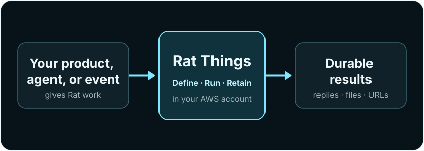

# How Rat Things operates

Rat Things is the open-source, self-hostable backend for cloud agents, applications, CLIs, and
provider events. A host installs one independent deployment, supplies identity and OAuth, and
decides whether that deployment serves one person, a team, or users of another product. Rat Things
supplies the common automation contract and isolated execution runtime; it does not require a
Rat-operated control plane or user interface.

> Once this narrow journey is delightful and stable, expand it.

<figure class="doc-visual doc-visual-wide">
  <a href="product-overview.svg"></a>
  <figcaption><strong>One backend, one durable result.</strong> Implementation detail stays out of the product overview.</figcaption>
</figure>

## The narrow journey

Every consumer uses the same path:

```text
install -> discover -> draft -> explain/test -> activate -> run -> observe
                              \-> connect accounts only when the Thing needs them
```

1. **Install** one deployment in the host's AWS account and choose its authentication boundary. The
   [AWS-ready ten-minute quickstart](quickstart.md) proves the smallest honest version before optional systems
   are added.
2. **Discover** its OpenAPI contract, schemas, capability profiles, and installed integration
   manifests instead of assuming what it supports.
3. **Connect an account only when needed** with the fields declared by an integration manifest. Rat verifies the
   credential with the provider, derives the account identity and provider permissions, then stores
   the credential outside run state.
4. **Draft a Thing** containing reusable intent, a trigger, a capability profile, account
   selections, and delivery—never credential values. Updates create immutable revisions and move
   only the draft pointer.
5. **Explain and test the draft.** Rat resolves the selected accounts and shows the fixed effective
   capability envelope and blocking diagnostics without exposing secrets. A test
   run never changes production.
6. **Activate one exact tested revision.** The API calls this operation `publish`. The caller
   supplies the successful test Run ID, expected draft revision, and expected `specHash`; Rat
   verifies all four identities before atomically moving the active pointer. Later edits create a
   new draft while production remains pinned.
7. **Run** the active Thing manually or through an EventBridge `rate(...)` or `cron(...)` schedule.
   Signed provider events use separate authenticated ingress and converge on the same owner-scoped
   run backend; generic provider-event Thing triggers are not part of v1.
8. **Observe and debug** through stable run states, events, ordinary input requests, retained files,
   publications, error envelopes, and trace IDs.

The CLI is one consumer of this contract, not a privileged path. An operator console, another
agent, a SaaS backend, and a signed webhook can use the same primitives.

## The core objects

| Product term | Meaning | Important boundary |
| --- | --- | --- |
| **Thing** | A versioned, reusable cloud agent | Contains intent and account references, never credentials |
| **Integration** | A trusted manifest plus typed operations for an external service | User-facing term; the implementation is a trusted plugin |
| **Account** | One provider-verified identity connected by one Rat owner | The API object is a connection; the provider supplies its identity |
| **Grant** | The owner's persistent Rat-side permission ceiling for an account | Can narrow provider authority, never widen it |
| **Account set** | A reusable group of accounts, including several accounts for one integration | The API calls this a connection set |
| **Run** | One durable execution of a Thing or lower-level request | Asynchronous, owner-scoped, observable, and idempotent |
| **Conversation** | The durable continuity boundary for related work | Holds transcript, organization state, files, and optional native workspace continuity |
| **Thread** | A caller or provider key that selects a conversation | A thread key is an input coordinate, not another execution receipt |
| **Message** | One durable user or assistant transcript entry | Public IDs are opaque and do not expose provider, storage, or runtime coordinates |
| **Turn** | Agent processing for one accepted conversation input | The accepted input still returns a normal Run receipt |

Product documentation uses **integration**, **account**, and **account set**. Plugin, connection,
credential binding, and broker are implementation or API-reference terms used when their precision
matters.

Documentation uses **activate a Thing revision** for moving the tested draft to the active pointer.
It uses **retain a file** for durable owner-scoped storage, **owner-gated viewing** for authenticated
access, and **expiring external sharing** for bearer links. This avoids using “publish” or “private
sharing” for several different security boundaries.

## Permission is an intersection

An operation is available only when every authority layer permits it:

```text
deployment/profile ceiling
       ∩ provider authorization
       ∩ persistent account grant
       ∩ Thing or run selection
       ∩ operation and resource constraints
       = effective permission
```

`read-only`, `read-write`, and `full` are useful presets; operation allow/deny lists and resource
constraints provide narrower control. Together with provider scopes, profile ceilings, IAM, and
network policy, they form the fixed envelope admitted before launch. The agent can autonomously use
every exposed operation; there is no later approval step. Outside that envelope, an operation is
omitted or denied by its enforcing layer. The denial does not suspend the Run or create a request
that a person can approve.

If a provider cannot report fine-grained scopes, Rat records that uncertainty rather than inventing
precision. A host may still apply a narrower Rat grant. Use `thing-explain` before activating a Thing
to see the resolved intersection for every selected account and operation.

## The host owns identity and OAuth

Rat Things deliberately does not decide the host's product or tenancy model.

- The host authenticates people and services and supplies a trusted principal.
- Rat derives the owner from that principal; callers cannot choose another owner ID.
- The host owns OAuth applications, provider review, and the user-facing consent context. The
  self-hosted Rat deployment can own the registered callback, PKCE/code exchange, and refresh
  lifecycle when its Terraform map names the provider application secret ARN.
- Rat verifies the resulting credential through the manifest-defined connection contract, stores
  it in the deployment's secret vault, and never returns it.
- One deployment may serve one owner or many owners. Rat enforces owner isolation; the host decides
  how those owners map to people, organizations, or customers.

This is **self-hosted, bring your own OAuth**, not a central Rat OAuth service. An embedded product
may still complete OAuth in its own backend and pass the resulting credential object over the
authenticated control API. A personal deployment can instead use the built-in AWS callback through
the desktop Connections page or `rat-things connect PLUGIN --oauth --wait`.
Existing accounts reconnect through the same operator surfaces. OAuth reconnect state is pinned to
the current Connection and grant, and the replacement is accepted only for the same verified
provider tenant/subject. The scheduled health job is a separate no-ingress control-plane Lambda;
it is not a Run and cannot be invoked by prompt content.

## Consumers build the experience

Rat Things publishes the primitives needed to build a simple interface without duplicating
provider-specific logic:

- `/.well-known/rat-things` describes the deployment and links its contracts;
- `/openapi.json` describes installed HTTP operations;
- `/v1/integrations/plugins` declares authentication fields and typed provider operations;
- connection detail, bounded manual/scheduled health testing, identity-preserving reconnect, and
  owner-scoped “used by” routes support a trustworthy Connection Center without reading credential values;
- Thing JSON Schemas support forms, editor completion, validation, and agent tool definitions;
- `thing-explain` resolves accounts and permissions before execution; and
- stable errors, run states, events, files, and publications support progress and recovery UX.

A consumer should render manifests, preserve opaque Rat IDs, and let Rat remain authoritative for
ownership, provider verification, permission resolution, and run state. It should not maintain a
second catalog of credential fields or infer account authority from a user-selected label.

## Intentionally outside the narrow journey

The first product path does not require a visual workflow editor, public marketplace, central
tenant service, arbitrary runtime package loading, or enterprise administration suite. Those
features can be considered after the discover-connect-explain-run path is consistently simple and
reliable.

Browser computer use, conversations, files, publications, schedules, and channels extend what a
Thing can do. They remain capabilities behind the same Thing, fixed-envelope, run, and
evidence boundaries rather than separate product models.

Read [the capability envelope](capability-envelope.md) before enabling connected-account writes,
broad egress, or browser interaction.

## Continue by task

- [Reach and invoke the first active Thing from an AWS-ready account](quickstart.md)
- [Build and run a Thing](things.md)
- [Connect another agent](agents.md)
- [Connect accounts and understand permissions](plugins.md)
- [Embed Rat Things in another product](embedding.md)
- [Self-host a deployment](development-and-deployment.md)
- [Debug the public primitives](diagnostics.md)
- [Use the control API](api.md)
- [Understand the isolation architecture](architecture.md)
- [Review what has been live validated](status-and-roadmap.md)
