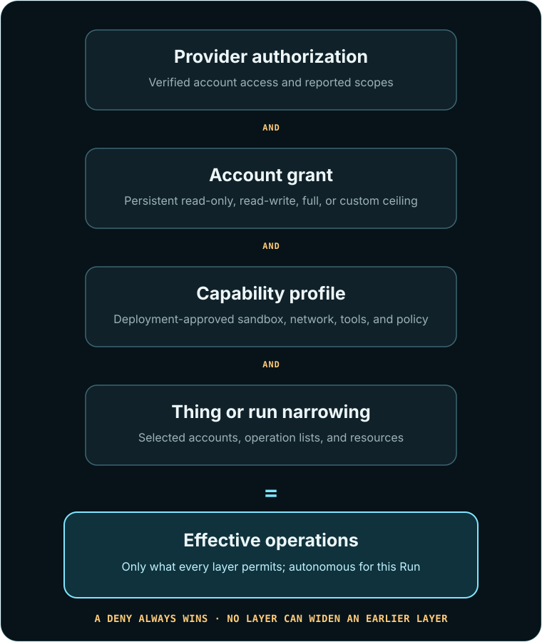
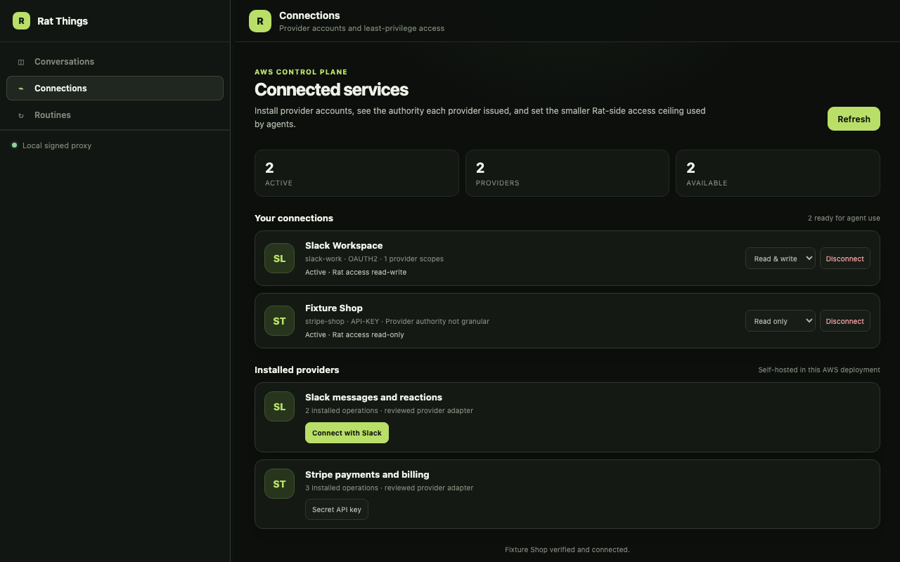
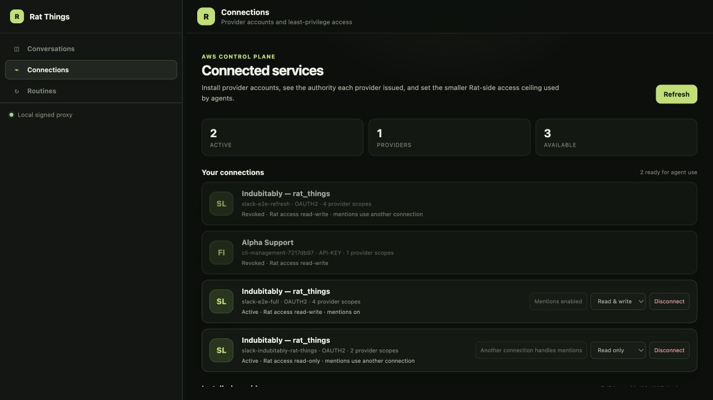

# Integrations, accounts, and permissions

Command convention: this guide uses the installed `rat-things` shorthand. From a source checkout,
use `npm run rat-things --` before the same arguments, or run `npm run build && npm link` once.

Rat Things turns trusted external APIs into agent-visible tools. One deployment can serve one
person, a team, or an embedded product; every connection remains scoped to the authenticated owner.
An owner can connect several accounts for the same service and grant each account different access.
This is the account-connection step in the [Rat Things operating model](operating-model.md).

> Once this narrow journey is delightful and stable, expand it.

The narrow journey is:

```text
discover integration -> supply credential -> verify provider account -> choose Rat access
                     -> select and narrow accounts for a Thing/run -> launch autonomously
```

This is the useful core of a Zapier-like integration system, not a claim of Zapier parity. Zapier's
current platform also separates authentication/connections from typed triggers, searches, and
actions. Its official references are the
[CLI platform overview](https://docs.zapier.com/integrations/build-cli/overview),
[authentication overview](https://docs.zapier.com/integrations/build/auth),
[OAuth v2 flow](https://docs.zapier.com/integrations/build/oauth), and
[recommended triggers and actions](https://docs.zapier.com/integrations/quickstart/recommended-triggers-and-actions).
Rat Things applies that model to a headless, self-hosted agent backend with explicit permissions.

## The Integration Contract v1

| Object | Purpose | Secret material? |
| --- | --- | --- |
| Integration manifest | Describes authentication fields and typed operations; implemented by a trusted plugin | No |
| Connection | One verified provider account for one Rat owner | No |
| Credential binding | Host-only pointer to the encrypted credential | Reference only |
| Grant | Persistent Rat-side permission ceiling for one connection | No |
| Connection set | Reusable selection of accounts, including multiple accounts for one plugin | No |
| Run selection | Selects and optionally narrows accounts for one run | No |

The API accepts a credential, but it does not accept claims about which account or permissions that
credential represents. The plugin verifies the credential against its fixed provider API and
derives the account label, tenant/subject identifiers, provider access, and provider scopes. Only a
successful verification creates the secret and connection metadata.

The credential value is never returned. It is not copied into a run request, Thing, DynamoDB record,
MicroVM launch payload, App Server tool schema, model-visible environment variable, URL, or log.

## 1. Discover what the deployment supports

Every UI, agent, and integration client starts with the same endpoint:

```http
GET /v1/integrations/plugins
```

A manifest describes the exact authentication fields and operations installed in that deployment:

```json
{
  "id": "stripe",
  "version": "1",
  "title": "Stripe",
  "authentication": [
    {
      "scheme": "api-key",
      "title": "Secret API key",
      "fields": [
        { "key": "api_key", "label": "Secret key", "secret": true }
      ]
    }
  ],
  "operations": [
    {
      "id": "stripe.customers.search",
      "kind": "search",
      "access": "read",
      "risk": "routine",
      "requiredProviderScopes": ["customers.read"]
    }
  ]
}
```

Consumers should render or request only the declared fields. Do not hard-code provider credential
forms separately from the manifest. If a plugin offers more than one authentication scheme, the
consumer asks the operator to choose one.

## 2. Connect and verify one account

For the CLI, create a short-lived, owner-readable credential file containing only the fields from
the selected authentication definition:

```bash
umask 077
printf '{"api_key":"replace-with-issued-key"}\n' > /secure/tmp/stripe.json

rat-things plugins
rat-things connect stripe \
  --credential-file /secure/tmp/stripe.json \
  --access read-only
rat-things connections
```

`connect` discovers the manifest, validates the exact field names, chooses the sole authentication
scheme when unambiguous, and defaults the Rat grant to `read-only`. Use `--auth-scheme oauth2` when
a plugin has several schemes. `--alias` is optional: Rat derives a readable alias from the verified
provider label and adds `-2`, `-3`, and so on when needed.

The equivalent API request is deliberately small:

```json
{
  "version": "1",
  "pluginId": "stripe",
  "authScheme": "api-key",
  "credential": {
    "api_key": "supplied-only-to-this-management-call"
  },
  "grant": {
    "version": "1",
    "preset": "read-only"
  }
}
```

The authenticated principal becomes the owner; callers cannot submit `ownerId`. The response
contains derived metadata and the initial grant, never the credential or vault reference:

```json
{
  "connection": {
    "version": "1",
    "connectionId": "...",
    "ownerId": "api:authenticated-principal",
    "pluginId": "stripe",
    "alias": "stripe-acme-shop",
    "label": "Acme Shop",
    "externalTenantId": "acct_...",
    "authorization": {
      "scheme": "api-key",
      "access": "full",
      "scopeModel": "unknown",
      "scopes": []
    },
    "status": "active",
    "createdAt": "2026-08-22T12:00:00.000Z",
    "updatedAt": "2026-08-22T12:00:00.000Z"
  },
  "grant": {
    "version": "1",
    "grantId": "...",
    "ownerId": "api:authenticated-principal",
    "connectionId": "...",
    "preset": "read-only"
  }
}
```

A rejected credential returns `400 invalid_request`, creates no secret, and is safe to correct and
resubmit. Provider identity is established before persistence, so callers cannot label an unrelated
token as another tenant or fabricate its scopes. Provider throttling, 5xx responses, and network
failure return retryable `503 integration_unavailable` rather than blaming the credential.

## 3. Connect multiple accounts

Run `connect` again for every account. Aliases are unique only within the Rat owner:

```bash
rat-things connect slack --auth-scheme oauth2 \
  --credential-file /secure/tmp/client-a.json --alias slack-client-a
rat-things connect slack --auth-scheme oauth2 \
  --credential-file /secure/tmp/client-b.json --alias slack-client-b
```

The accounts share a plugin implementation but never credentials or authority. An agent tool call
selects the exact account alias. If only one eligible account is configured as a default, the
generated tool schema can omit the account; ambiguous multi-account tools require an explicit alias.

Connection sets make a selection reusable:

```bash
rat-things connection-set --file /secure/config/customer-ops.json
```

```json
{
  "version": "1",
  "name": "customer-ops",
  "connections": ["slack-client-a", "slack-client-b", "stripe-acme-shop"],
  "defaults": {
    "support": "slack-client-a",
    "billing": "stripe-acme-shop"
  }
}
```

Use the set from a direct run:

```bash
rat-things --thread customer-ops \
  --profile small-business \
  --connection-set customer-ops \
  --connection slack-client-b=read-only \
  "Review support and billing exceptions"
```

Or place the same aliases/set in a versioned Thing. `rat-things thing-explain THING_ID` resolves the
accounts and shows why every operation is allowed or denied before the Thing is published.

## 4. Understand effective permission

<figure class="doc-visual doc-visual-tall">
  <a href="permission-intersection.svg"></a>
  <figcaption><strong>Permission is always an intersection.</strong> The resulting operation set is fixed before launch and autonomous during the Run.</figcaption>
</figure>

An operation is available only when every applicable layer permits it:

1. The verified provider authorization permits the access level and required provider scopes.
2. The persistent connection grant permits the operation.
3. The selected capability profile does not forbid it.
4. A Thing or run-level selection may narrow it again.
5. Deny lists, expiry, resource constraints, IAM, and egress policy are enforced.

The effective permission is the intersection, never the union. A full-access provider key can be
exposed to Rat as read-only. A read-only provider token cannot be widened by a Rat grant.

| Rat preset | Eligible operation access |
| --- | --- |
| `read-only` | `read` |
| `read-write` | `read`, `write` |
| `full` | `read`, `write`, `full` |
| `custom` | IDs explicitly listed in `allowOperations` |

Provider and Rat permission remain separate. When a provider reports granular scopes, both layers
enforce them. When an API key is broad or the provider does not expose scope metadata, the
connection honestly records `coarse` or `unknown`; Rat still enforces its grant, but the provider
credential itself remains broad.

For tighter control, replace the persistent grant:

```bash
rat-things grant slack-client-a --file /secure/config/slack-client-a-grant.json
```

```json
{
  "version": "1",
  "preset": "custom",
  "allowOperations": ["slack.messages.search", "slack.messages.post"],
  "denyOperations": [],
  "resourceConstraints": {
    "channel": ["C01234567"]
  },
  "expiresAt": "2026-12-31T23:59:59Z"
}
```

`resourceConstraints` match operation input fields before the credential is read. Every exposed
operation is available for autonomous use during the Run. There is no approval step, so omit or
deny an operation unless the full admitted input range is safe. See [the capability
envelope](capability-envelope.md).

## 5. Rotate or revoke safely

Rotation uses the same credential-only file journey as connection setup:

```bash
rat-things rotate stripe-acme-shop --credential-file /secure/tmp/stripe-rotated.json
rat-things revoke stripe-old-account
```

Rat verifies a rotated credential before replacing the stored value and rejects it if its provider
tenant or subject differs from the existing connection. Revocation marks the connection inactive
and asks the vault to delete the credential. Existing run requests cannot bypass revocation because
connection status is checked again when an agent tool session is created.

The raw rotation API request is `{"version":"1","credential":{...}}`.

## Self-hosted OAuth installation

Rat Things includes an authorization-code/PKCE callback and automatic refresh lifecycle in each AWS
deployment. It is still **bring your own OAuth application**: the operator registers the provider
app, accepts any provider review, chooses the installed plugin scopes, and stores the app credential
in that deployment's AWS Secrets Manager. Rat never operates a central OAuth client or receives the
credential.

The first apply can leave OAuth unconfigured. Read `terraform output -raw oauth_callback_url`,
register that exact HTTPS URL with the provider, and create a secret containing:

```json
{
  "client_id": "provider-application-id",
  "client_secret": "provider-application-secret"
}
```

Then pass only its ARN and apply again:

```hcl
integration_oauth_app_secret_arns = {
  slack = "arn:aws:secretsmanager:us-west-2:111122223333:secret:rat/oauth/slack-AbCdEf"
}
```

`GET /v1/integrations/plugins` reports `oauthInstallation.status` as `configured` or
`host-required` and returns the exact callback URL. Start a connection from the desktop Connections
page or the CLI:



```bash
rat-things connect slack --oauth --wait --access read-write --alias slack-work
# Add --no-browser on a headless operator host and open the printed URL elsewhere.
rat-things slack-events slack-work --profile read-only --json
```

`--wait` polls only the owner-scoped connection catalog and returns the verified connection bundle
after the callback succeeds. Omit it when the shell should return the expiring authorization URL
immediately. The URL and callback never contain the provider application secret or issued token.

The authenticated start call creates a ten-minute, owner-bound state, stores only its SHA-256 hash,
and generates an S256 PKCE challenge. The public callback atomically consumes that state before code
exchange, verifies the resulting provider identity through the ordinary connection service, and
only then persists the credential. Provider endpoints, scopes, and token authentication method come
from the reviewed compiled plugin; callers cannot substitute them.

When a provider issues `expires_in` and a refresh token, the credential broker refreshes two minutes
before expiry behind a short per-connection DynamoDB lease. Refresh responses replace the same
Secrets Manager value. Concurrent workers wait for that replacement. Terraform gives the MicroVM
only the configured application-secret ARN map; the execution role may resolve only those exact
secrets, and neither the application secret nor issued tokens enter the agent's prompt or tool
arguments. A provider that does not issue a refresh token requires reconnection after expiry.

Slack uses two independently rotating OAuth token families in one owner-scoped credential. The bot
token receives `app_mentions:read`, `chat:write`, and `reactions:write`; the delegated installing-user
token receives `search:read`. Message search therefore sees only what that Slack user is allowed to
see. Rat uses the user token only for `slack.messages.search` and the bot token for identity, posts,
replies, reactions, and source delivery. Each access/refresh/expiry family is refreshed separately;
a response to one refresh is not required to repeat the other token family.

`slack-events` derives the workspace selector from the verified Connection rather than accepting a
caller-supplied team ID. It creates one owner Connection Set and a team-wide source binding,
idempotently repairs the service Connection grant to `read-write`, and leaves the source agent on the
requested profile (`read-only` by default). Only one Connection may route mentions for a workspace;
attempting to enable another returns a conflict instead of silently changing credentials. The
trusted notifier may use the bound service Connection to reply in the source thread even though the
agent itself receives only the read-only tool envelope.

The complete success path was live-validated on 2026-08-28 PDT with a disposable Slack app and
workspace. The built CLI generated the PKCE authorization, waited for the AWS callback, returned the
verified public Connection, and the desktop Connections page round-tripped its Rat grant between
`read-only` and `read-write`. Slack issued all four requested scopes across bot and delegated-user
tokens. A signed human `app_mention` started a real Codex Run and the notifier replied in its Slack
thread; a same-thread turn resumed the same MicroVM and native Codex thread and recalled prior
context. The built CLI separately posted one root plus one thread reply, added a reaction, proved a
read-only write denial, and used delegated search to recover the exact thread text and permalink.
The canary then forced both token-family expiries stale; fresh Runs refreshed the bot and user
credentials independently and completed authenticated post/search operations. Access and refresh
tokens were checked only for presence and never printed. Consent denial, callback replay, concurrent
refresh fencing, and provider-side revocation remain explicit follow-up canaries.

The live Connections workspace below shows the operator-visible result after the canary: the active
OAuth account, its provider-issued scope count, the smaller persistent Rat access ceiling, and the
single account that owns mention routing. Revoked recovery fixtures remain visible as lifecycle
evidence but are unavailable to agents.



Never place a token or application secret in a command-line argument, webhook body, Thing, run
request, DynamoDB record, or URL. Keep provider exchange logs redacted. Already-issued OAuth tokens
and API keys remain supported through the manifest-driven credential-file flow.

## Source-bound permissions

A verified webhook source can select a preconfigured capability profile and/or connection set only
after provider signature verification:

```bash
rat-things bind-source --file /secure/config/client-channel-binding.json
```

```json
{
  "version": "1",
  "sourceKind": "slack",
  "selector": {
    "teamId": "T01234567",
    "channelId": "C01234567"
  },
  "capabilityProfile": "small-business",
  "connectionSetId": "customer-ops"
}
```

Selectors match trusted normalized source fields. A binding does not change run ownership or embed
a credential. Generic source-binding creation is currently a trusted operator action; do not
delegate arbitrary selectors to tenants. For Slack, prefer `slack-events`: it derives `teamId` from
the verified OAuth Connection and atomically refuses a competing exact workspace claim.

## Built-in and fixture integrations

| Plugin | Operations | Availability |
| --- | --- | --- |
| Slack | API test, message search/post, reaction add | Built in |
| Stripe | Customer search, invoice list, refund create | Built in |
| Fixture CRM | Record search/create with two permission-distinct accounts | Tests only |

The HTTP adapters pin credential-free API base URLs, reject redirects and origin escapes, bound
request/response bodies, and attach credentials only inside trusted code. Fixture CRM is compiled
only when `INTEGRATION_PLUGIN_BASE_URLS` supplies its base URL. It exists to prove onboarding,
verified identity, provider scopes, multiple accounts, autonomous read/write intersection,
exactly-one fixture mutation, and secret non-disclosure without depending on a customer's
third-party account.

## Add a trusted integration

Integration plugins are trusted TypeScript adapters compiled into the MicroVM image:

1. Define an `IntegrationPluginManifest` in `src/plugins/integrations` with a lowercase plugin ID,
   authentication definitions, and namespaced operation IDs.
2. Implement `verifyCredential`. Call a fixed provider identity endpoint and return a bounded label,
   provider authorization, and stable tenant/subject IDs when available. Never trust those values
   from the connection-create request.
3. Define each operation's access, risk, required provider scopes, and closed JSON
   input schema.
4. Prefer `TrustedHttpIntegrationPlugin`: use a credential-free HTTPS base URL and construct only
   relative paths from validated inputs. Never let the model provide an origin.
5. Register the adapter in `src/plugins/integrations/builtins.ts` and rebuild the trusted image.
6. Add contract, simulation, LocalStack, and disposable live-AWS tests. Prove a read, an
   autonomously admitted write, a denied credential/scope, account selection, and absence of secret
   values.

Ingress signature parsing remains in `src/ingress`/`src/channels`; outbound result notification
remains in `src/delivery`. Agent-callable integration operations belong here. The architecture check
enforces those boundaries.

Arbitrary package loading, a public marketplace, a visual workflow editor, and a broad app catalog
are intentionally deferred. The current contract is the extension point: one reviewed manifest,
one verifier, typed operations, optional self-hosted OAuth metadata, and the same API for CLIs,
agents, and product UIs.

For failures, follow [integration diagnostics](diagnostics.md#debug-an-integration-connection).
For consumer architecture and OAuth ownership, see [embedding and self-hosting](embedding.md).
