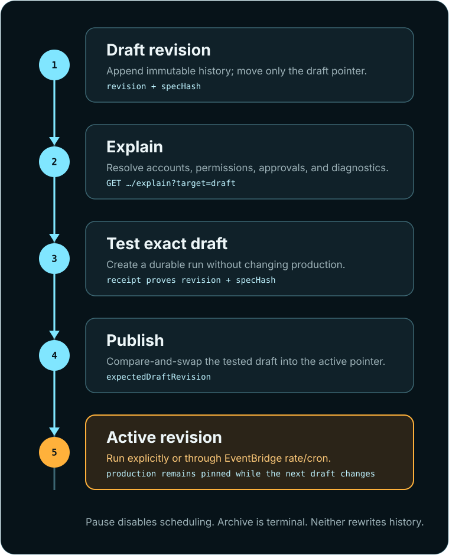

# Things: reusable cloud agents

A **Thing** is Rat Things' product-facing contract for a reusable cloud agent. It defines the goal,
trigger, capability profile, connected accounts, and result destinations without containing a
credential value. Things work behind an operator UI, another product, a CLI, or another agent.

The design rule is deliberately small: **once this narrow journey is delightful and stable,
expand it.** The journey is create, explain, test, publish, and observe.

## The shortest working flow

```bash
rat-things thing-release --file examples/thing-create.json
rat-things thing-run THING_ID --idempotency-key first-production-run
```

`thing-release --file` is the first-use path. It creates draft revision 1, explains it, stops on any
blocking diagnostic, tests it, waits for success, and publishes only when the successful Run proves
the same Thing ID, revision, and `specHash`. Its JSON result contains the created Thing, test Run,
and active Thing, so `THING_ID` above comes from `created.thingId`.

For an existing draft, `thing-release THING_ID` performs the same explain→test→exact-publish gate.
`thing-update` fetches the current draft revision and applies compare-and-swap automatically. The
lower-level `thing-publish THING_ID --test-run RUN_ID` is intentionally inconvenient: it still sends
the current draft revision and hash, and the service independently verifies that the referenced Run
succeeded as a test of that exact draft.

Remote execution defaults to `danger-full-access` with command networking enabled because the
outer MicroVM is the primary isolation boundary. For a first test, explicitly choose the narrowest
installed profile, `sandbox: "read-only"`, `approvalPolicy: "untrusted"`, user review, and disabled
network/search/browser; widen only for the task. Rat Things is an engineering preview, so connected
account writes and public sharing require deliberate review.

Remote commands use `RAT_THINGS_API_URL`, infer the AWS Region from an API Gateway URL when
possible, and SigV4-sign requests. Reusing an idempotency key safely retries the same semantic run.
Creation itself has no idempotency key in v1. If its response is lost, list Things and reconcile the
intended definition by `specHash` before retrying rather than blindly creating a duplicate.
Every Thing test/run receipt includes the exact `thingId`, immutable `revision`, `specHash`, and
invocation kind alongside the run ID. Compare that evidence with the draft you accepted before
publishing.

## The mental model

A Thing is a stable ID with immutable revisions and two explicit pointers:

```text
Thing ID
  draft  ──> revision 3   safe to explain and test
  active ──> revision 2   exact production definition
```

Editing appends revision 3 and moves only `draft`. Production stays on revision 2 until publish.
Publishing atomically points `active` at the current draft; every run records its exact revision.
There is no mutable definition and no silent production edit.

`GET /v1/things/{thingId}` makes this state explicit:

```json
{
  "version": "1",
  "thingId": "...",
  "status": "active",
  "draft": {
    "version": "1",
    "thingId": "...",
    "revision": 3,
    "name": "Customer operations review",
    "trigger": { "kind": "manual" },
    "specHash": "...",
    "createdAt": "...",
    "spec": { "version": "1", "name": "...", "goal": "...", "trigger": { "kind": "manual" } }
  },
  "active": {
    "version": "1",
    "thingId": "...",
    "revision": 2,
    "name": "Customer operations review",
    "trigger": { "kind": "manual" },
    "specHash": "...",
    "createdAt": "...",
    "spec": { "version": "1", "name": "...", "goal": "...", "trigger": { "kind": "manual" } }
  },
  "hasUnpublishedChanges": true,
  "triggerState": { "status": "ready", "revision": 2, "updatedAt": "..." },
  "createdAt": "...",
  "updatedAt": "..."
}
```

List responses contain the same lifecycle and revision metadata but omit both complete specs, so
inventory views do not unnecessarily copy goals into tables or logs.

## ThingSpec v1

The machine contract is [ThingSpec v1 JSON Schema](../spec/schemas/thing-v1.json). A deployment
serves it at `/schemas/thing-v1.json`; `GET /.well-known/rat-things` links the installed schema,
OpenAPI document, capabilities, and centrally hosted agent documentation.
JSON Schema `maxLength` counts characters while the runtime's documented limits count UTF-8 bytes;
multibyte input can pass schema preflight and still be rejected by the runtime.

Create accepts the ThingSpec itself:

```http
POST /v1/things HTTP/1.1
Content-Type: application/json

{
  "version": "1",
  "name": "Safe reusable baseline",
  "goal": "Inspect the provided workspace and summarize its current state. Do not use external services or make changes.",
  "trigger": { "kind": "manual" },
  "agent": {
    "driver": "codex",
    "sandbox": "read-only",
    "capabilities": {
      "profile": "read-only",
      "approvalPolicy": "untrusted",
      "approvalsReviewer": "user",
      "networkAccess": false,
      "webSearch": "disabled",
      "computerUse": "disabled"
    }
  },
  "execution": { "backend": "microvm", "timeoutSeconds": 300 },
  "deliver": [{ "kind": "none" }]
}
```

This is the checked-in [safe first-run example](https://gpazo.github.io/Rat-Things/examples/thing-create.json). The separate
[connected schedule example](https://gpazo.github.io/Rat-Things/examples/thing-connected-schedule.json) demonstrates browser use,
several accounts, a write-capable grant, Slack delivery, and EventBridge cron only after those
capabilities are intentionally selected.

| Field | Meaning |
| --- | --- |
| `version` | Contract version; currently exactly `"1"` |
| `name` | Human-facing label, at most 128 UTF-8 bytes |
| `goal` | Agent instruction, at most 100,000 UTF-8 bytes |
| `trigger` | Authenticated `manual` invocation or an EventBridge `schedule` |
| `repository` | Optional credential-free HTTPS repository selection |
| `agent` | Model, reasoning, sandbox, profile, browser, search, skills, apps, and MCP selection |
| `connections` | Optional connection set and/or multiple explicit account selections |
| `execution` | Optional MicroVM backend and timeout selection |
| `deliver` | Up to eight explicit `teams`, `slack`, or `none` destinations |
| `metadata` | Application JSON; Rat-owned Thing occurrence keys are reserved |

Thing specs cannot select a credential secret, forge a provider source, set a parent run, or use a
`source` result destination. Provider events continue through signature-verified ingress adapters.

## Triggers

### Manual

```json
{ "kind": "manual" }
```

An authenticated consumer invokes the active revision with `thing-run`. The latest draft uses the
separate `thing-test` route, so production and validation are never ambiguous.

### EventBridge Scheduler

```json
{
  "kind": "schedule",
  "expression": "rate(15 minutes)"
}
```

```json
{
  "kind": "schedule",
  "expression": "cron(0 9 ? * MON-FRI *)",
  "timezone": "America/Los_Angeles"
}
```

Rat uses Amazon EventBridge Scheduler, not legacy scheduled EventBridge rules. `rate(...)` supports
minute, hour, and day units. `cron(...)` uses the six EventBridge fields: minutes, hours,
day-of-month, month, day-of-week, and year. Exactly one day field uses `?`. `timezone` is an IANA
name and defaults to UTC. Scheduler has one-minute precision; one-time `at(...)` schedules are not
part of ThingSpec v1.

Each published scheduled Thing owns one opaque schedule in a deployment-owned schedule group. Rat
owns the Lambda target, invocation role, retry policy, and dead-letter queue; a Thing cannot select
an arbitrary AWS target or IAM role. The payload pins `thingId`, active revision, and
`<aws.scheduler.scheduled-time>`.

The trusted target checks all of these before submission:

- the Thing still exists and is `active`;
- the delivered revision is still the active revision; and
- that revision still has a schedule trigger.

Paused and stale deliveries are acknowledged without creating a run. Accepted occurrences use
Thing ID, revision, and scheduled time as their idempotency key. Publishing, pausing, resuming, and
archiving wait for Scheduler synchronization. If AWS rejects synchronization, the API returns an
error and the Thing exposes `triggerState.status: "error"`; retrying the same lifecycle operation
is safe and attempts synchronization again.

Interactive approvals and input requests exist only while that occurrence's MicroVM is active;
there is no durable human-approval inbox in v1. Do not publish unattended scheduled work that can
require user review unless the host watches active runs. Otherwise choose a policy/profile designed
for unattended execution and bound every external side effect with account grants and operation
rules.

## Lifecycle

<figure class="doc-visual doc-visual-tall">
  <a href="thing-lifecycle.svg"></a>
  <figcaption><strong>Draft and active are separate pointers.</strong> Testing proves an exact revision; publishing moves production deliberately.</figcaption>
</figure>

| Status | Draft test | Active explicit run | Scheduled delivery | Edit | Next action |
| --- | --- | --- | --- | --- | --- |
| `draft` | Yes | No active revision | No | Yes | Publish |
| `active` | Yes | Yes | Yes when scheduled | Yes, without changing production | Pause or publish |
| `paused` | Yes | Yes | No | Yes | Resume or publish |
| `archived` | No | No | No; schedule removed | No | Terminal |

The lifecycle operations are intentionally literal:

- `test` runs `draft` and never publishes it;
- `publish` pins the current draft as `active` and activates its trigger;
- `run` invokes the active revision, even while scheduling is paused;
- `pause` disables scheduled delivery but does not cancel an in-flight run;
- `resume` re-synchronizes and enables the active schedule;
- `archive` is terminal and removes the schedule.

Publishing while paused publishes and activates the selected draft. Restoring a historical
definition means using it as the input to `thing-update`, which creates a new immutable revision;
history itself is never mutated.

## Editing and immutable history

The API uses an explicit compare-and-swap envelope:

```http
POST /v1/things/THING_ID/versions HTTP/1.1
Content-Type: application/json

{
  "version": "1",
  "expectedDraftRevision": 2,
  "spec": {
    "version": "1",
    "name": "Customer operations review",
    "goal": "Review only; make no external changes.",
    "trigger": { "kind": "schedule", "expression": "rate(30 minutes)" }
  }
}
```

A stale writer receives `409 conflict`. `rat-things thing-update ID --file THING.json` discovers
and supplies `expectedDraftRevision` automatically. Historical definitions remain at
`GET .../versions/{revision}` and are content-digested. Complete specs live in a private,
versioned, KMS-encrypted definition bucket; DynamoDB stores only lifecycle metadata and references.

## Multiple accounts and permissions

`connections.set` selects an owner-scoped connection set. `accounts` adds or narrows exact aliases
or IDs, including several accounts for the same provider:

```json
{
  "connections": {
    "set": "agency-defaults",
    "accounts": [
      { "account": "slack-agency", "access": "read-write" },
      { "account": "slack-client-a", "access": "read-only" },
      {
        "account": "slack-client-b",
        "access": "custom",
        "allowOperations": ["slack.messages.search"]
      }
    ]
  }
}
```

The per-Thing request can only narrow authority. Effective access is the intersection of provider
authorization, the persistent Rat grant, capability profile, and Thing selection.
`denyOperations` wins. Credential values remain host-owned and are read only immediately before an
authorized tool call. See [integrations, accounts, and permissions](plugins.md).

## Explain and debug

`thing-explain` defaults to the draft so it answers “is this safe to publish?” Use
`--target active` to explain production:

```bash
rat-things thing-explain THING_ID
rat-things thing-explain THING_ID --target active
```

The response validates the stored digest, compiles the exact run request, resolves profiles,
accounts, grants, provider authorization, operations, approvals, and trigger health without
reading credential values. `triggerState` is also returned by get/list for quick operational
debugging:

| Trigger state | Meaning |
| --- | --- |
| `inactive` | No published trigger exists, or the Thing is archived |
| `syncing` | A lifecycle operation has committed and AWS synchronization is in progress |
| `ready` | The active trigger matches the published revision |
| `paused` | The active schedule exists but is disabled |
| `error` | AWS synchronization failed; `error` contains a bounded diagnostic and retry is safe |

## API and CLI reference

| API | CLI | Purpose |
| --- | --- | --- |
| `GET /v1/things` | `things [--all]` | List owner-scoped lifecycle summaries |
| `POST /v1/things` | `thing-create --file THING.json` | Create draft revision 1 from a ThingSpec |
| `GET /v1/things/{id}` | `thing ID` | Get draft, active, and complete definitions |
| `GET .../{id}/versions` | `thing-versions ID` | List immutable revision metadata |
| `GET .../{id}/versions/{revision}` | `thing-version ID REVISION` | Get one historical definition |
| `POST .../{id}/versions` | `thing-update ID --file THING.json` | Append and select a draft revision |
| `GET .../{id}/explain?target=...` | `thing-explain ID [--target ...]` | Resolve draft or production behavior |
| `POST .../{id}/test` | `thing-test ID` | Run the latest draft |
| `POST .../{id}/publish` | `thing-publish ID --test-run RUN_ID` | Verify exact successful test evidence, pin the draft as active, and synchronize its trigger |
| Create + explain + test + publish | `thing-release --file THING.json` or `thing-release ID` | Safe one-command release journey built from the same public routes |
| `POST .../{id}/run` | `thing-run ID` | Run the active revision explicitly |
| `POST .../{id}/pause` | `thing-pause ID` | Disable scheduled delivery |
| `POST .../{id}/resume` | `thing-resume ID` | Re-enable the active schedule |
| `POST .../{id}/archive` | `thing-archive ID` | Make the Thing terminal and remove its schedule |

## Definition of done

The lifecycle is covered at four levels:

- unit tests validate parsing, immutable pointers, lifecycle retries, and trigger health;
- simulation tests exercise the complete Thing-to-durable-run path and duplicate/stale delivery;
- LocalStack tests run the control and trusted Scheduler Lambda handlers against real DynamoDB,
  encrypted-definition references, S3 run inputs, and SQS wake-ups; and
- live AWS tests inspect the created Scheduler resource, wait for an actual invocation, verify the
  pinned run input, then pause, resume, archive, and confirm deletion and empty failure queues.

See [embedding and self-hosting](embedding.md) for frontend boundaries and
[diagnostics](diagnostics.md) when the narrow journey does not behave as expected.
